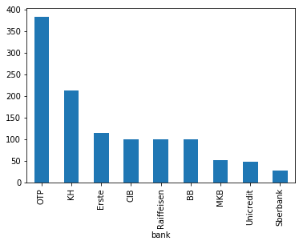
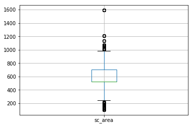
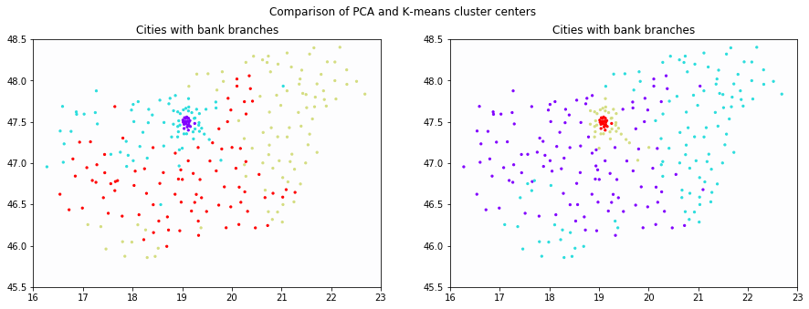

# Final assignment - Szabolcs Kerekes - student ID: 120204

## Summary of the analysis
Our analysis aims to answer the following questions:
1. What is the relationship between accessability of banking services (measured by the number of banks by 1000 people) and the concentration of banks (measured by the Herfindahl-Hirschman Index) currently in Hungary?
2. What are the charachteristics of the groups created by clustering the cities, when considering accessability of banking services, concentration of banks, and other region specific economic measures currently in Hungary?

For question **1)** the analysis shows that there is a some weak positive connection between the lack of accessability of banking services and the concentration of banks. Put it differently, this means that a city with two banks on average will most likely have less than twice the population than a city with only one banking firm present.


For question **2)** the analysis yielded four different clusters, that are mainly charachterised by either good economic figures, high accessability and low concentration of banks, or low economic figures, low accessability and high concentration of banks (or are placed in between these two ends).


The limitations of our work are the following:
* our dataset only contains data for 9 banks, and does not include certain small sized banks, as well as the Takarek Bank Group, which services many cities that are not served by any other banking groups
* the values of the available features are several years old, thus they might not paint an accurate picture of the current differences
* the features are more focused on sub-county and county level data then city level data, which is a result of the low availability of city level data

Our dataset is composed of the following features:
- **Address:** this is the actual address (excluding zip code) for the bank branch. The information on the branch location was collected from different sources, and represents the latest available data.
- **Bank:** this is the name of the bank.
- **ID:** this is a unique ID for each observation.
- **City:** the name of the city where the branch is located (please note that the actual type of the establishment can be other than ‘city’)
- **Zip code:** this is the zip code of the branch.
- **County:** this is the county of the branch.
- **City population (2018):** the population of the city where the branch is located.
- **County population (2018):** the population of the county where the branch is located.
- **Type of the city:** the actual type of the establishment following the official definition (e.g. city, town, etc.).
- **County GDP per capita (2018):** The GDP per capita per county as of 2018.
- **County unemployment (2018):** The unemployment level in the county as of 2018.
- **County net salary per person (2018):** The net salary per person in the county as of 2018.
- **Sub-county:** The name of the sub-county (called as officially “Járás”).
- **Sub-county population (2011):** The population of the sub-county as of 2011.
- **Sub-county tax base per capita (2010):** The tax base per person in HUF in the sub-county as of 2010.
- **Sub-county number of cars per capita (2014):** The number of cars per person as of 2014.
- **Sub-county unemployment (2014):** The level of unemployment in the sub-county as of 2014.
- **Sub-county area (2011):** The area of the sub-county in square-kilometers.

In order to foster reproduciblity, in the following we will detail the steps of the analysis along with comments on the codes used.


```python
# we turn of warnings for easier processing of outputs
import warnings
warnings.filterwarnings("ignore")
```

## Cleaning of the data

### Importing the data

We start with importing the data from a csv type spreadsheet.


```python
import pandas as pd
banks = pd.read_csv("all_banks_final.csv")
banks
```


<div>
<style scoped>
    .dataframe tbody tr th:only-of-type {
        vertical-align: middle;
    }

    .dataframe tbody tr th {
        vertical-align: top;
    }

    .dataframe thead th {
        text-align: right;
    }
</style>
<table border="1" class="dataframe">
  <thead>
    <tr style="text-align: right;">
      <th></th>
      <th>Unnamed: 0</th>
      <th>address</th>
      <th>bank</th>
      <th>ID</th>
      <th>city</th>
      <th>zip</th>
      <th>county</th>
      <th>city_pop</th>
      <th>c_pop</th>
      <th>type</th>
      <th>c_gdp_per_cap</th>
      <th>c_employment</th>
      <th>c_net_salary</th>
      <th>sub_county</th>
      <th>sc_population</th>
      <th>sc_taxbase_per_capita</th>
      <th>sc_no_of_cars_per_cap</th>
      <th>sc_unemployement</th>
      <th>sc_area</th>
    </tr>
  </thead>
  <tbody>
    <tr>
      <th>0</th>
      <td>1</td>
      <td>Hungary Budapest Batthyányi tér 5-6.</td>
      <td>Raiffeisen</td>
      <td>Raiffeisen1</td>
      <td>Budapest01</td>
      <td>1011</td>
      <td>BUD</td>
      <td>14211</td>
      <td>1693051</td>
      <td>city district</td>
      <td>8070</td>
      <td>0.035</td>
      <td>270292</td>
      <td>Budapesti</td>
      <td>1740041.0</td>
      <td>1111221.0</td>
      <td>0.342413</td>
      <td>0.032094</td>
      <td>525.0</td>
    </tr>
    <tr>
      <th>1</th>
      <td>2</td>
      <td>Hungary Budapest Iskola u. 38-42.</td>
      <td>OTP</td>
      <td>OTP2</td>
      <td>Budapest01</td>
      <td>1011</td>
      <td>BUD</td>
      <td>14211</td>
      <td>1693051</td>
      <td>city district</td>
      <td>8070</td>
      <td>0.035</td>
      <td>270292</td>
      <td>Budapesti</td>
      <td>1740041.0</td>
      <td>1111221.0</td>
      <td>0.342413</td>
      <td>0.032094</td>
      <td>525.0</td>
    </tr>
    <tr>
      <th>2</th>
      <td>3</td>
      <td>Hungary Budapest Krisztina tér 10.</td>
      <td>CIB</td>
      <td>CIB1</td>
      <td>Budapest01</td>
      <td>1013</td>
      <td>BUD</td>
      <td>14211</td>
      <td>1693051</td>
      <td>city district</td>
      <td>8070</td>
      <td>0.035</td>
      <td>270292</td>
      <td>Budapesti</td>
      <td>1740041.0</td>
      <td>1111221.0</td>
      <td>0.342413</td>
      <td>0.032094</td>
      <td>525.0</td>
    </tr>
    <tr>
      <th>3</th>
      <td>4</td>
      <td>Hungary Budapest Krisztina tér 2.</td>
      <td>Erste</td>
      <td>Erste114</td>
      <td>Budapest01</td>
      <td>1013</td>
      <td>BUD</td>
      <td>14211</td>
      <td>1693051</td>
      <td>city district</td>
      <td>8070</td>
      <td>0.035</td>
      <td>270292</td>
      <td>Budapesti</td>
      <td>1740041.0</td>
      <td>1111221.0</td>
      <td>0.342413</td>
      <td>0.032094</td>
      <td>525.0</td>
    </tr>
    <tr>
      <th>4</th>
      <td>5</td>
      <td>Hungary Budapest Alagút u. 3.</td>
      <td>OTP</td>
      <td>OTP1</td>
      <td>Budapest01</td>
      <td>1013</td>
      <td>BUD</td>
      <td>14211</td>
      <td>1693051</td>
      <td>city district</td>
      <td>8070</td>
      <td>0.035</td>
      <td>270292</td>
      <td>Budapesti</td>
      <td>1740041.0</td>
      <td>1111221.0</td>
      <td>0.342413</td>
      <td>0.032094</td>
      <td>525.0</td>
    </tr>
    <tr>
      <th>5</th>
      <td>6</td>
      <td>Hungary Budapest Széna tér 1/a.</td>
      <td>Raiffeisen</td>
      <td>Raiffeisen2</td>
      <td>Budapest01</td>
      <td>1015</td>
      <td>BUD</td>
      <td>14211</td>
      <td>1693051</td>
      <td>city district</td>
      <td>8070</td>
      <td>0.035</td>
      <td>270292</td>
      <td>Budapesti</td>
      <td>1740041.0</td>
      <td>1111221.0</td>
      <td>0.342413</td>
      <td>0.032094</td>
      <td>525.0</td>
    </tr>
    <tr>
      <th>6</th>
      <td>7</td>
      <td>Hungary Budapest Széna tér 7.</td>
      <td>OTP</td>
      <td>OTP4</td>
      <td>Budapest01</td>
      <td>1015</td>
      <td>BUD</td>
      <td>14211</td>
      <td>1693051</td>
      <td>city district</td>
      <td>8070</td>
      <td>0.035</td>
      <td>270292</td>
      <td>Budapesti</td>
      <td>1740041.0</td>
      <td>1111221.0</td>
      <td>0.342413</td>
      <td>0.032094</td>
      <td>525.0</td>
    </tr>
    <tr>
      <th>7</th>
      <td>8</td>
      <td>Hungary Budapest Hűvösvölgyi út 138.</td>
      <td>CIB</td>
      <td>CIB2</td>
      <td>Budapest02</td>
      <td>1021</td>
      <td>BUD</td>
      <td>47592</td>
      <td>1693051</td>
      <td>city district</td>
      <td>8070</td>
      <td>0.035</td>
      <td>270292</td>
      <td>Budapesti</td>
      <td>1740041.0</td>
      <td>1111221.0</td>
      <td>0.342413</td>
      <td>0.032094</td>
      <td>525.0</td>
    </tr>
    <tr>
      <th>8</th>
      <td>9</td>
      <td>Hungary Budapest Hűvösvölgyi út 138. (StopShop)</td>
      <td>Erste</td>
      <td>Erste113</td>
      <td>Budapest02</td>
      <td>1021</td>
      <td>BUD</td>
      <td>47592</td>
      <td>1693051</td>
      <td>city district</td>
      <td>8070</td>
      <td>0.035</td>
      <td>270292</td>
      <td>Budapesti</td>
      <td>1740041.0</td>
      <td>1111221.0</td>
      <td>0.342413</td>
      <td>0.032094</td>
      <td>525.0</td>
    </tr>
    <tr>
      <th>9</th>
      <td>10</td>
      <td>Hungary Budapest Hüvösvölgyi út 138. (Stop Shop)</td>
      <td>OTP</td>
      <td>OTP8</td>
      <td>Budapest02</td>
      <td>1021</td>
      <td>BUD</td>
      <td>47592</td>
      <td>1693051</td>
      <td>city district</td>
      <td>8070</td>
      <td>0.035</td>
      <td>270292</td>
      <td>Budapesti</td>
      <td>1740041.0</td>
      <td>1111221.0</td>
      <td>0.342413</td>
      <td>0.032094</td>
      <td>525.0</td>
    </tr>
    <tr>
      <th>10</th>
      <td>11</td>
      <td>Hungary Budapest Bég u 3-5.</td>
      <td>Unicredit</td>
      <td>Unicredit18</td>
      <td>Budapest02</td>
      <td>1022</td>
      <td>BUD</td>
      <td>47592</td>
      <td>1693051</td>
      <td>city district</td>
      <td>8070</td>
      <td>0.035</td>
      <td>270292</td>
      <td>Budapesti</td>
      <td>1740041.0</td>
      <td>1111221.0</td>
      <td>0.342413</td>
      <td>0.032094</td>
      <td>525.0</td>
    </tr>
    <tr>
      <th>11</th>
      <td>12</td>
      <td>Hungary Budapest Frankel Leó utca 45. - Óbuda</td>
      <td>Sberbank</td>
      <td>Sberbank1</td>
      <td>Budapest02</td>
      <td>1023</td>
      <td>BUD</td>
      <td>47592</td>
      <td>1693051</td>
      <td>city district</td>
      <td>8070</td>
      <td>0.035</td>
      <td>270292</td>
      <td>Budapesti</td>
      <td>1740041.0</td>
      <td>1111221.0</td>
      <td>0.342413</td>
      <td>0.032094</td>
      <td>525.0</td>
    </tr>
    <tr>
      <th>12</th>
      <td>13</td>
      <td>Hungary Budapest Lajos u. 30.</td>
      <td>BB</td>
      <td>BB1</td>
      <td>Budapest02</td>
      <td>1023</td>
      <td>BUD</td>
      <td>47592</td>
      <td>1693051</td>
      <td>city district</td>
      <td>8070</td>
      <td>0.035</td>
      <td>270292</td>
      <td>Budapesti</td>
      <td>1740041.0</td>
      <td>1111221.0</td>
      <td>0.342413</td>
      <td>0.032094</td>
      <td>525.0</td>
    </tr>
    <tr>
      <th>13</th>
      <td>14</td>
      <td>Hungary Budapest Bécsi út 3-5.</td>
      <td>Unicredit</td>
      <td>Unicredit1</td>
      <td>Budapest02</td>
      <td>1023</td>
      <td>BUD</td>
      <td>47592</td>
      <td>1693051</td>
      <td>city district</td>
      <td>8070</td>
      <td>0.035</td>
      <td>270292</td>
      <td>Budapesti</td>
      <td>1740041.0</td>
      <td>1111221.0</td>
      <td>0.342413</td>
      <td>0.032094</td>
      <td>525.0</td>
    </tr>
    <tr>
      <th>14</th>
      <td>15</td>
      <td>Hungary Budapest Retek utca 20.</td>
      <td>Sberbank</td>
      <td>Sberbank2</td>
      <td>Budapest02</td>
      <td>1024</td>
      <td>BUD</td>
      <td>47592</td>
      <td>1693051</td>
      <td>city district</td>
      <td>8070</td>
      <td>0.035</td>
      <td>270292</td>
      <td>Budapesti</td>
      <td>1740041.0</td>
      <td>1111221.0</td>
      <td>0.342413</td>
      <td>0.032094</td>
      <td>525.0</td>
    </tr>
    <tr>
      <th>15</th>
      <td>16</td>
      <td>Hungary Budapest Lövőház u. 7-9.</td>
      <td>CIB</td>
      <td>CIB3</td>
      <td>Budapest02</td>
      <td>1024</td>
      <td>BUD</td>
      <td>47592</td>
      <td>1693051</td>
      <td>city district</td>
      <td>8070</td>
      <td>0.035</td>
      <td>270292</td>
      <td>Budapesti</td>
      <td>1740041.0</td>
      <td>1111221.0</td>
      <td>0.342413</td>
      <td>0.032094</td>
      <td>525.0</td>
    </tr>
    <tr>
      <th>16</th>
      <td>17</td>
      <td>Hungary Budapest Petrezselyem u. 2-8</td>
      <td>CIB</td>
      <td>CIB4</td>
      <td>Budapest02</td>
      <td>1024</td>
      <td>BUD</td>
      <td>47592</td>
      <td>1693051</td>
      <td>city district</td>
      <td>8070</td>
      <td>0.035</td>
      <td>270292</td>
      <td>Budapesti</td>
      <td>1740041.0</td>
      <td>1111221.0</td>
      <td>0.342413</td>
      <td>0.032094</td>
      <td>525.0</td>
    </tr>
    <tr>
      <th>17</th>
      <td>18</td>
      <td>Hungary Budapest Lövőház utca 2-6. 2.em.-Mamut 1.</td>
      <td>KH</td>
      <td>KH1</td>
      <td>Budapest02</td>
      <td>1024</td>
      <td>BUD</td>
      <td>47592</td>
      <td>1693051</td>
      <td>city district</td>
      <td>8070</td>
      <td>0.035</td>
      <td>270292</td>
      <td>Budapesti</td>
      <td>1740041.0</td>
      <td>1111221.0</td>
      <td>0.342413</td>
      <td>0.032094</td>
      <td>525.0</td>
    </tr>
    <tr>
      <th>18</th>
      <td>19</td>
      <td>Hungary Budapest Margit krt. 43-45.</td>
      <td>KH</td>
      <td>KH2</td>
      <td>Budapest02</td>
      <td>1024</td>
      <td>BUD</td>
      <td>47592</td>
      <td>1693051</td>
      <td>city district</td>
      <td>8070</td>
      <td>0.035</td>
      <td>270292</td>
      <td>Budapesti</td>
      <td>1740041.0</td>
      <td>1111221.0</td>
      <td>0.342413</td>
      <td>0.032094</td>
      <td>525.0</td>
    </tr>
    <tr>
      <th>19</th>
      <td>20</td>
      <td>Hungary Budapest Margit krt. 5/a</td>
      <td>KH</td>
      <td>KH3</td>
      <td>Budapest02</td>
      <td>1024</td>
      <td>BUD</td>
      <td>47592</td>
      <td>1693051</td>
      <td>city district</td>
      <td>8070</td>
      <td>0.035</td>
      <td>270292</td>
      <td>Budapesti</td>
      <td>1740041.0</td>
      <td>1111221.0</td>
      <td>0.342413</td>
      <td>0.032094</td>
      <td>525.0</td>
    </tr>
    <tr>
      <th>20</th>
      <td>21</td>
      <td>Hungary Budapest Lövőház u. 2-6.</td>
      <td>Raiffeisen</td>
      <td>Raiffeisen3</td>
      <td>Budapest02</td>
      <td>1024</td>
      <td>BUD</td>
      <td>47592</td>
      <td>1693051</td>
      <td>city district</td>
      <td>8070</td>
      <td>0.035</td>
      <td>270292</td>
      <td>Budapesti</td>
      <td>1740041.0</td>
      <td>1111221.0</td>
      <td>0.342413</td>
      <td>0.032094</td>
      <td>525.0</td>
    </tr>
    <tr>
      <th>21</th>
      <td>22</td>
      <td>Hungary Budapest Széna tér 4.</td>
      <td>MKB</td>
      <td>MKB1</td>
      <td>Budapest02</td>
      <td>1024</td>
      <td>BUD</td>
      <td>47592</td>
      <td>1693051</td>
      <td>city district</td>
      <td>8070</td>
      <td>0.035</td>
      <td>270292</td>
      <td>Budapesti</td>
      <td>1740041.0</td>
      <td>1111221.0</td>
      <td>0.342413</td>
      <td>0.032094</td>
      <td>525.0</td>
    </tr>
    <tr>
      <th>22</th>
      <td>23</td>
      <td>Hungary Budapest II. kerület Lövőház u. 2-6. sz</td>
      <td>BB</td>
      <td>BB2</td>
      <td>Budapest02</td>
      <td>1024</td>
      <td>BUD</td>
      <td>47592</td>
      <td>1693051</td>
      <td>city district</td>
      <td>8070</td>
      <td>0.035</td>
      <td>270292</td>
      <td>Budapesti</td>
      <td>1740041.0</td>
      <td>1111221.0</td>
      <td>0.342413</td>
      <td>0.032094</td>
      <td>525.0</td>
    </tr>
    <tr>
      <th>23</th>
      <td>24</td>
      <td>Hungary Budapest Margit krt. 87-89. (Mammut II.)</td>
      <td>Unicredit</td>
      <td>Unicredit2</td>
      <td>Budapest02</td>
      <td>1024</td>
      <td>BUD</td>
      <td>47592</td>
      <td>1693051</td>
      <td>city district</td>
      <td>8070</td>
      <td>0.035</td>
      <td>270292</td>
      <td>Budapesti</td>
      <td>1740041.0</td>
      <td>1111221.0</td>
      <td>0.342413</td>
      <td>0.032094</td>
      <td>525.0</td>
    </tr>
    <tr>
      <th>24</th>
      <td>25</td>
      <td>Hungary Budapest Margit körút 87-89.</td>
      <td>Erste</td>
      <td>Erste111</td>
      <td>Budapest02</td>
      <td>1024</td>
      <td>BUD</td>
      <td>47592</td>
      <td>1693051</td>
      <td>city district</td>
      <td>8070</td>
      <td>0.035</td>
      <td>270292</td>
      <td>Budapesti</td>
      <td>1740041.0</td>
      <td>1111221.0</td>
      <td>0.342413</td>
      <td>0.032094</td>
      <td>525.0</td>
    </tr>
    <tr>
      <th>25</th>
      <td>26</td>
      <td>Hungary Budapest Lövőház utca 1-5. 3. emelet</td>
      <td>Erste</td>
      <td>Erste112</td>
      <td>Budapest02</td>
      <td>1024</td>
      <td>BUD</td>
      <td>47592</td>
      <td>1693051</td>
      <td>city district</td>
      <td>8070</td>
      <td>0.035</td>
      <td>270292</td>
      <td>Budapesti</td>
      <td>1740041.0</td>
      <td>1111221.0</td>
      <td>0.342413</td>
      <td>0.032094</td>
      <td>525.0</td>
    </tr>
    <tr>
      <th>26</th>
      <td>27</td>
      <td>Hungary Budapest Fény u. 11-13.</td>
      <td>OTP</td>
      <td>OTP5</td>
      <td>Budapest02</td>
      <td>1024</td>
      <td>BUD</td>
      <td>47592</td>
      <td>1693051</td>
      <td>city district</td>
      <td>8070</td>
      <td>0.035</td>
      <td>270292</td>
      <td>Budapesti</td>
      <td>1740041.0</td>
      <td>1111221.0</td>
      <td>0.342413</td>
      <td>0.032094</td>
      <td>525.0</td>
    </tr>
    <tr>
      <th>27</th>
      <td>28</td>
      <td>Hungary Budapest Törökvész út 1/a.</td>
      <td>OTP</td>
      <td>OTP6</td>
      <td>Budapest02</td>
      <td>1025</td>
      <td>BUD</td>
      <td>47592</td>
      <td>1693051</td>
      <td>city district</td>
      <td>8070</td>
      <td>0.035</td>
      <td>270292</td>
      <td>Budapesti</td>
      <td>1740041.0</td>
      <td>1111221.0</td>
      <td>0.342413</td>
      <td>0.032094</td>
      <td>525.0</td>
    </tr>
    <tr>
      <th>28</th>
      <td>29</td>
      <td>Hungary Budapest Törökvész út.87-91 (Rózsadomb...</td>
      <td>OTP</td>
      <td>OTP7</td>
      <td>Budapest02</td>
      <td>1025</td>
      <td>BUD</td>
      <td>47592</td>
      <td>1693051</td>
      <td>city district</td>
      <td>8070</td>
      <td>0.035</td>
      <td>270292</td>
      <td>Budapesti</td>
      <td>1740041.0</td>
      <td>1111221.0</td>
      <td>0.342413</td>
      <td>0.032094</td>
      <td>525.0</td>
    </tr>
    <tr>
      <th>29</th>
      <td>30</td>
      <td>Hungary Budapest Szépvölgyi út 4/b.</td>
      <td>OTP</td>
      <td>OTP10</td>
      <td>Budapest02</td>
      <td>1025</td>
      <td>BUD</td>
      <td>47592</td>
      <td>1693051</td>
      <td>city district</td>
      <td>8070</td>
      <td>0.035</td>
      <td>270292</td>
      <td>Budapesti</td>
      <td>1740041.0</td>
      <td>1111221.0</td>
      <td>0.342413</td>
      <td>0.032094</td>
      <td>525.0</td>
    </tr>
    <tr>
      <th>...</th>
      <td>...</td>
      <td>...</td>
      <td>...</td>
      <td>...</td>
      <td>...</td>
      <td>...</td>
      <td>...</td>
      <td>...</td>
      <td>...</td>
      <td>...</td>
      <td>...</td>
      <td>...</td>
      <td>...</td>
      <td>...</td>
      <td>...</td>
      <td>...</td>
      <td>...</td>
      <td>...</td>
      <td>...</td>
    </tr>
    <tr>
      <th>1104</th>
      <td>1105</td>
      <td>Hungary Fertőd Fő u. 7.</td>
      <td>OTP</td>
      <td>OTP201</td>
      <td>Fertőd</td>
      <td>9431</td>
      <td>GYO</td>
      <td>3290</td>
      <td>453080</td>
      <td>city</td>
      <td>5044</td>
      <td>0.019</td>
      <td>221963</td>
      <td>Soproni</td>
      <td>100155.0</td>
      <td>769938.0</td>
      <td>0.384599</td>
      <td>0.010452</td>
      <td>868.0</td>
    </tr>
    <tr>
      <th>1105</th>
      <td>1106</td>
      <td>Hungary Fertőszentmiklós Szerdahelyi u. 2.</td>
      <td>OTP</td>
      <td>OTP202</td>
      <td>Fertőszentmiklós</td>
      <td>9444</td>
      <td>GYO</td>
      <td>3805</td>
      <td>453080</td>
      <td>city</td>
      <td>5044</td>
      <td>0.019</td>
      <td>221963</td>
      <td>Soproni</td>
      <td>100155.0</td>
      <td>769938.0</td>
      <td>0.384599</td>
      <td>0.010452</td>
      <td>868.0</td>
    </tr>
    <tr>
      <th>1106</th>
      <td>1107</td>
      <td>Hungary Celldömölk dr. Géfin L. tér 13.</td>
      <td>KH</td>
      <td>KH207</td>
      <td>Celldömölk</td>
      <td>9500</td>
      <td>VAS</td>
      <td>10654</td>
      <td>253383</td>
      <td>city</td>
      <td>3747</td>
      <td>0.035</td>
      <td>196339</td>
      <td>Celldömölki</td>
      <td>24071.0</td>
      <td>754440.0</td>
      <td>0.319818</td>
      <td>0.047050</td>
      <td>474.0</td>
    </tr>
    <tr>
      <th>1107</th>
      <td>1108</td>
      <td>Hungary Celldömölk Kossuth L. u. 18.</td>
      <td>OTP</td>
      <td>OTP357</td>
      <td>Celldömölk</td>
      <td>9500</td>
      <td>VAS</td>
      <td>10654</td>
      <td>253383</td>
      <td>city</td>
      <td>3747</td>
      <td>0.035</td>
      <td>196339</td>
      <td>Celldömölki</td>
      <td>24071.0</td>
      <td>754440.0</td>
      <td>0.319818</td>
      <td>0.047050</td>
      <td>474.0</td>
    </tr>
    <tr>
      <th>1108</th>
      <td>1109</td>
      <td>Hungary Sárvár Batthyány L. u. 1-3.</td>
      <td>KH</td>
      <td>KH208</td>
      <td>Sárvár</td>
      <td>9600</td>
      <td>VAS</td>
      <td>14856</td>
      <td>253383</td>
      <td>city</td>
      <td>3747</td>
      <td>0.035</td>
      <td>196339</td>
      <td>Sárvári</td>
      <td>38450.0</td>
      <td>824009.0</td>
      <td>0.345548</td>
      <td>0.035212</td>
      <td>685.0</td>
    </tr>
    <tr>
      <th>1109</th>
      <td>1110</td>
      <td>Hungary Sárvár Batthyány utca 12.</td>
      <td>Raiffeisen</td>
      <td>Raiffeisen98</td>
      <td>Sárvár</td>
      <td>9600</td>
      <td>VAS</td>
      <td>14856</td>
      <td>253383</td>
      <td>city</td>
      <td>3747</td>
      <td>0.035</td>
      <td>196339</td>
      <td>Sárvári</td>
      <td>38450.0</td>
      <td>824009.0</td>
      <td>0.345548</td>
      <td>0.035212</td>
      <td>685.0</td>
    </tr>
    <tr>
      <th>1110</th>
      <td>1111</td>
      <td>Hungary Sárvár Batthyány utca 20.</td>
      <td>Erste</td>
      <td>Erste3</td>
      <td>Sárvár</td>
      <td>9600</td>
      <td>VAS</td>
      <td>14856</td>
      <td>253383</td>
      <td>city</td>
      <td>3747</td>
      <td>0.035</td>
      <td>196339</td>
      <td>Sárvári</td>
      <td>38450.0</td>
      <td>824009.0</td>
      <td>0.345548</td>
      <td>0.035212</td>
      <td>685.0</td>
    </tr>
    <tr>
      <th>1111</th>
      <td>1112</td>
      <td>Hungary Sárvár Batthyány u. 2.</td>
      <td>OTP</td>
      <td>OTP356</td>
      <td>Sárvár</td>
      <td>9600</td>
      <td>VAS</td>
      <td>14856</td>
      <td>253383</td>
      <td>city</td>
      <td>3747</td>
      <td>0.035</td>
      <td>196339</td>
      <td>Sárvári</td>
      <td>38450.0</td>
      <td>824009.0</td>
      <td>0.345548</td>
      <td>0.035212</td>
      <td>685.0</td>
    </tr>
    <tr>
      <th>1112</th>
      <td>1113</td>
      <td>Hungary Szombathely Rákóczi Ferenc utca 1.</td>
      <td>Sberbank</td>
      <td>Sberbank25</td>
      <td>Szombathely</td>
      <td>9700</td>
      <td>VAS</td>
      <td>76528</td>
      <td>253383</td>
      <td>country centre</td>
      <td>3747</td>
      <td>0.035</td>
      <td>196339</td>
      <td>Szombathelyi</td>
      <td>113063.0</td>
      <td>941284.0</td>
      <td>0.369779</td>
      <td>0.030157</td>
      <td>646.0</td>
    </tr>
    <tr>
      <th>1113</th>
      <td>1114</td>
      <td>Hungary Szombathely Fő tér 33.</td>
      <td>CIB</td>
      <td>CIB100</td>
      <td>Szombathely</td>
      <td>9700</td>
      <td>VAS</td>
      <td>76528</td>
      <td>253383</td>
      <td>country centre</td>
      <td>3747</td>
      <td>0.035</td>
      <td>196339</td>
      <td>Szombathelyi</td>
      <td>113063.0</td>
      <td>941284.0</td>
      <td>0.369779</td>
      <td>0.030157</td>
      <td>646.0</td>
    </tr>
    <tr>
      <th>1114</th>
      <td>1115</td>
      <td>Hungary Szombathely Kőszegi u. 10.</td>
      <td>KH</td>
      <td>KH209</td>
      <td>Szombathely</td>
      <td>9700</td>
      <td>VAS</td>
      <td>76528</td>
      <td>253383</td>
      <td>country centre</td>
      <td>3747</td>
      <td>0.035</td>
      <td>196339</td>
      <td>Szombathelyi</td>
      <td>113063.0</td>
      <td>941284.0</td>
      <td>0.369779</td>
      <td>0.030157</td>
      <td>646.0</td>
    </tr>
    <tr>
      <th>1115</th>
      <td>1116</td>
      <td>Hungary Szombathely Fő tér 29.</td>
      <td>Raiffeisen</td>
      <td>Raiffeisen99</td>
      <td>Szombathely</td>
      <td>9700</td>
      <td>VAS</td>
      <td>76528</td>
      <td>253383</td>
      <td>country centre</td>
      <td>3747</td>
      <td>0.035</td>
      <td>196339</td>
      <td>Szombathelyi</td>
      <td>113063.0</td>
      <td>941284.0</td>
      <td>0.369779</td>
      <td>0.030157</td>
      <td>646.0</td>
    </tr>
    <tr>
      <th>1116</th>
      <td>1117</td>
      <td>Hungary Szombathely Fő tér 36.</td>
      <td>Raiffeisen</td>
      <td>Raiffeisen100</td>
      <td>Szombathely</td>
      <td>9700</td>
      <td>VAS</td>
      <td>76528</td>
      <td>253383</td>
      <td>country centre</td>
      <td>3747</td>
      <td>0.035</td>
      <td>196339</td>
      <td>Szombathelyi</td>
      <td>113063.0</td>
      <td>941284.0</td>
      <td>0.369779</td>
      <td>0.030157</td>
      <td>646.0</td>
    </tr>
    <tr>
      <th>1117</th>
      <td>1118</td>
      <td>Hungary Szombathely Szent Márton u. 4.</td>
      <td>MKB</td>
      <td>MKB41</td>
      <td>Szombathely</td>
      <td>9700</td>
      <td>VAS</td>
      <td>76528</td>
      <td>253383</td>
      <td>country centre</td>
      <td>3747</td>
      <td>0.035</td>
      <td>196339</td>
      <td>Szombathelyi</td>
      <td>113063.0</td>
      <td>941284.0</td>
      <td>0.369779</td>
      <td>0.030157</td>
      <td>646.0</td>
    </tr>
    <tr>
      <th>1118</th>
      <td>1119</td>
      <td>Hungary Szombathely Kőszegi u. 3/a.</td>
      <td>BB</td>
      <td>BB99</td>
      <td>Szombathely</td>
      <td>9700</td>
      <td>VAS</td>
      <td>76528</td>
      <td>253383</td>
      <td>country centre</td>
      <td>3747</td>
      <td>0.035</td>
      <td>196339</td>
      <td>Szombathelyi</td>
      <td>113063.0</td>
      <td>941284.0</td>
      <td>0.369779</td>
      <td>0.030157</td>
      <td>646.0</td>
    </tr>
    <tr>
      <th>1119</th>
      <td>1120</td>
      <td>Hungary Szombathely Kőszegi u. 30-32.</td>
      <td>Unicredit</td>
      <td>Unicredit48</td>
      <td>Szombathely</td>
      <td>9700</td>
      <td>VAS</td>
      <td>76528</td>
      <td>253383</td>
      <td>country centre</td>
      <td>3747</td>
      <td>0.035</td>
      <td>196339</td>
      <td>Szombathelyi</td>
      <td>113063.0</td>
      <td>941284.0</td>
      <td>0.369779</td>
      <td>0.030157</td>
      <td>646.0</td>
    </tr>
    <tr>
      <th>1120</th>
      <td>1121</td>
      <td>Hungary Szombathely Mártírok tere 12.</td>
      <td>Erste</td>
      <td>Erste2</td>
      <td>Szombathely</td>
      <td>9700</td>
      <td>VAS</td>
      <td>76528</td>
      <td>253383</td>
      <td>country centre</td>
      <td>3747</td>
      <td>0.035</td>
      <td>196339</td>
      <td>Szombathelyi</td>
      <td>113063.0</td>
      <td>941284.0</td>
      <td>0.369779</td>
      <td>0.030157</td>
      <td>646.0</td>
    </tr>
    <tr>
      <th>1121</th>
      <td>1122</td>
      <td>Hungary Szombathely Fő tér 3-5.</td>
      <td>OTP</td>
      <td>OTP353</td>
      <td>Szombathely</td>
      <td>9700</td>
      <td>VAS</td>
      <td>76528</td>
      <td>253383</td>
      <td>country centre</td>
      <td>3747</td>
      <td>0.035</td>
      <td>196339</td>
      <td>Szombathelyi</td>
      <td>113063.0</td>
      <td>941284.0</td>
      <td>0.369779</td>
      <td>0.030157</td>
      <td>646.0</td>
    </tr>
    <tr>
      <th>1122</th>
      <td>1123</td>
      <td>Hungary Szombathely Rohonci u. 52.</td>
      <td>OTP</td>
      <td>OTP354</td>
      <td>Szombathely</td>
      <td>9700</td>
      <td>VAS</td>
      <td>76528</td>
      <td>253383</td>
      <td>country centre</td>
      <td>3747</td>
      <td>0.035</td>
      <td>196339</td>
      <td>Szombathelyi</td>
      <td>113063.0</td>
      <td>941284.0</td>
      <td>0.369779</td>
      <td>0.030157</td>
      <td>646.0</td>
    </tr>
    <tr>
      <th>1123</th>
      <td>1124</td>
      <td>Hungary Szombathely Király u. 10.</td>
      <td>OTP</td>
      <td>OTP362</td>
      <td>Szombathely</td>
      <td>9700</td>
      <td>VAS</td>
      <td>76528</td>
      <td>253383</td>
      <td>country centre</td>
      <td>3747</td>
      <td>0.035</td>
      <td>196339</td>
      <td>Szombathelyi</td>
      <td>113063.0</td>
      <td>941284.0</td>
      <td>0.369779</td>
      <td>0.030157</td>
      <td>646.0</td>
    </tr>
    <tr>
      <th>1124</th>
      <td>1125</td>
      <td>Hungary Kőszeg Fő tér 4.</td>
      <td>KH</td>
      <td>KH210</td>
      <td>Kőszeg</td>
      <td>9730</td>
      <td>VAS</td>
      <td>11427</td>
      <td>253383</td>
      <td>city</td>
      <td>3747</td>
      <td>0.035</td>
      <td>196339</td>
      <td>Kőszegi</td>
      <td>25978.0</td>
      <td>778702.0</td>
      <td>0.359887</td>
      <td>0.031746</td>
      <td>286.0</td>
    </tr>
    <tr>
      <th>1125</th>
      <td>1126</td>
      <td>Hungary Kőszeg Kossuth L. u. 8.</td>
      <td>OTP</td>
      <td>OTP358</td>
      <td>Kőszeg</td>
      <td>9730</td>
      <td>VAS</td>
      <td>11427</td>
      <td>253383</td>
      <td>city</td>
      <td>3747</td>
      <td>0.035</td>
      <td>196339</td>
      <td>Kőszegi</td>
      <td>25978.0</td>
      <td>778702.0</td>
      <td>0.359887</td>
      <td>0.031746</td>
      <td>286.0</td>
    </tr>
    <tr>
      <th>1126</th>
      <td>1127</td>
      <td>Hungary Bük Kossuth L. u. 1-3.</td>
      <td>OTP</td>
      <td>OTP361</td>
      <td>Bük</td>
      <td>9737</td>
      <td>VAS</td>
      <td>3492</td>
      <td>253383</td>
      <td>city</td>
      <td>3747</td>
      <td>0.035</td>
      <td>196339</td>
      <td>Kőszegi</td>
      <td>25978.0</td>
      <td>778702.0</td>
      <td>0.359887</td>
      <td>0.031746</td>
      <td>286.0</td>
    </tr>
    <tr>
      <th>1127</th>
      <td>1128</td>
      <td>Hungary Vasvár Alkotmány u. 2.</td>
      <td>OTP</td>
      <td>OTP360</td>
      <td>Vasvár</td>
      <td>9800</td>
      <td>VAS</td>
      <td>4207</td>
      <td>253383</td>
      <td>city</td>
      <td>3747</td>
      <td>0.035</td>
      <td>196339</td>
      <td>Vasvári</td>
      <td>13164.0</td>
      <td>649002.0</td>
      <td>0.325034</td>
      <td>0.058379</td>
      <td>374.0</td>
    </tr>
    <tr>
      <th>1128</th>
      <td>1129</td>
      <td>Hungary Körmend Vida utca 1/a</td>
      <td>KH</td>
      <td>KH211</td>
      <td>Körmend</td>
      <td>9900</td>
      <td>VAS</td>
      <td>11182</td>
      <td>253383</td>
      <td>city</td>
      <td>3747</td>
      <td>0.035</td>
      <td>196339</td>
      <td>Körmendi</td>
      <td>26664.0</td>
      <td>811011.0</td>
      <td>0.356719</td>
      <td>0.036731</td>
      <td>615.0</td>
    </tr>
    <tr>
      <th>1129</th>
      <td>1130</td>
      <td>Hungary Körmend Vida J. u. 12.</td>
      <td>OTP</td>
      <td>OTP355</td>
      <td>Körmend</td>
      <td>9900</td>
      <td>VAS</td>
      <td>11182</td>
      <td>253383</td>
      <td>city</td>
      <td>3747</td>
      <td>0.035</td>
      <td>196339</td>
      <td>Körmendi</td>
      <td>26664.0</td>
      <td>811011.0</td>
      <td>0.356719</td>
      <td>0.036731</td>
      <td>615.0</td>
    </tr>
    <tr>
      <th>1130</th>
      <td>1131</td>
      <td>Hungary Szentgotthárd Szél Kálmán tér 23.</td>
      <td>KH</td>
      <td>KH212</td>
      <td>Szentgotthárd</td>
      <td>9970</td>
      <td>VAS</td>
      <td>8578</td>
      <td>253383</td>
      <td>city</td>
      <td>3747</td>
      <td>0.035</td>
      <td>196339</td>
      <td>Szentgotthárdi</td>
      <td>15068.0</td>
      <td>779617.0</td>
      <td>0.335400</td>
      <td>0.033452</td>
      <td>255.0</td>
    </tr>
    <tr>
      <th>1131</th>
      <td>1132</td>
      <td>Hungary Szentgotthárd Széchenyi utca 2.</td>
      <td>Erste</td>
      <td>Erste1</td>
      <td>Szentgotthárd</td>
      <td>9970</td>
      <td>VAS</td>
      <td>8578</td>
      <td>253383</td>
      <td>city</td>
      <td>3747</td>
      <td>0.035</td>
      <td>196339</td>
      <td>Szentgotthárdi</td>
      <td>15068.0</td>
      <td>779617.0</td>
      <td>0.335400</td>
      <td>0.033452</td>
      <td>255.0</td>
    </tr>
    <tr>
      <th>1132</th>
      <td>1133</td>
      <td>Hungary Szentgotthárd Mártírok út 2.</td>
      <td>OTP</td>
      <td>OTP359</td>
      <td>Szentgotthárd</td>
      <td>9970</td>
      <td>VAS</td>
      <td>8578</td>
      <td>253383</td>
      <td>city</td>
      <td>3747</td>
      <td>0.035</td>
      <td>196339</td>
      <td>Szentgotthárdi</td>
      <td>15068.0</td>
      <td>779617.0</td>
      <td>0.335400</td>
      <td>0.033452</td>
      <td>255.0</td>
    </tr>
    <tr>
      <th>1133</th>
      <td>1134</td>
      <td>Hungary Szentgotthárd Füzesi út 15 (GM)</td>
      <td>OTP</td>
      <td>OTP363</td>
      <td>Szentgotthárd</td>
      <td>9970</td>
      <td>VAS</td>
      <td>8578</td>
      <td>253383</td>
      <td>city</td>
      <td>3747</td>
      <td>0.035</td>
      <td>196339</td>
      <td>Szentgotthárdi</td>
      <td>15068.0</td>
      <td>779617.0</td>
      <td>0.335400</td>
      <td>0.033452</td>
      <td>255.0</td>
    </tr>
  </tbody>
</table>
<p>1134 rows × 19 columns</p>
</div>


### Checking the data for duplicates

Then we check for duplicated values, fortunately there are none.


```python
banks.duplicated().sum()
```


    0


### Transforming the columns

As a next step we take a look at the variables and do the following:
   * change category variables into the proper type
   * drop the unneeded first column
   * rename and reorder the columns


```python
print(len(banks.dtypes))
banks.dtypes
```

    19


    Unnamed: 0                 int64
    address                   object
    bank                      object
    ID                        object
    city                      object
    zip                        int64
    county                    object
    city_pop                   int64
    c_pop                      int64
    type                      object
    c_gdp_per_cap              int64
    c_employment             float64
    c_net_salary               int64
    sub_county                object
    sc_population            float64
    sc_taxbase_per_capita    float64
    sc_no_of_cars_per_cap    float64
    sc_unemployement         float64
    sc_area                  float64
    dtype: object


We change those variables to category, which supposed to be categorical, but are currently stored as string in the data frame.


```python
banks["bank"] = banks["bank"].astype('category')
banks["city"] = banks["city"].astype('category')
banks["zip"] = banks["zip"].astype('category')
banks["county"] = banks["county"].astype('category')
banks["type"] = banks["type"].astype('category')
banks["sub_county"] = banks["sub_county"].astype('category')
banks.dtypes
```


    Unnamed: 0                  int64
    address                    object
    bank                     category
    ID                         object
    city                     category
    zip                      category
    county                   category
    city_pop                    int64
    c_pop                       int64
    type                     category
    c_gdp_per_cap               int64
    c_employment              float64
    c_net_salary                int64
    sub_county               category
    sc_population             float64
    sc_taxbase_per_capita     float64
    sc_no_of_cars_per_cap     float64
    sc_unemployement          float64
    sc_area                   float64
    dtype: object


We have no need for the "Unnamed: 0" column.


```python
banks.drop(columns = "Unnamed: 0", inplace = True)
banks.dtypes
```


    address                    object
    bank                     category
    ID                         object
    city                     category
    zip                      category
    county                   category
    city_pop                    int64
    c_pop                       int64
    type                     category
    c_gdp_per_cap               int64
    c_employment              float64
    c_net_salary                int64
    sub_county               category
    sc_population             float64
    sc_taxbase_per_capita     float64
    sc_no_of_cars_per_cap     float64
    sc_unemployement          float64
    sc_area                   float64
    dtype: object


We do some renaming and reordering to have a better structured data frame.


```python
banks = banks.rename(index=str, 
          columns={"c_pop": "county_pop",
                   "type" : "city_type",
                   "c_gdp_per_cap": "county_gdp_pcap",
                   "c_employment" : "county_unemployment", 
                   "c_net_salary" : "county_net_salary", 
                   "sc_taxbase_per_capita" : "sc_taxbase_pcap", 
                   "sc_no_of_cars_per_cap" : "sc_cars_pcap", 
                   "sc_unemployement" : "sc_unemployment"})
banks.dtypes
```


    address                  object
    bank                   category
    ID                       object
    city                   category
    zip                    category
    county                 category
    city_pop                  int64
    county_pop                int64
    city_type              category
    county_gdp_pcap           int64
    county_unemployment     float64
    county_net_salary         int64
    sub_county             category
    sc_population           float64
    sc_taxbase_pcap         float64
    sc_cars_pcap            float64
    sc_unemployment         float64
    sc_area                 float64
    dtype: object


```python
banks = banks.reindex(['ID','bank','address','zip','city','city_pop', 
                    'city_type', 'county', 'county_pop', 'county_gdp_pcap', 
                    'county_unemployment', 'county_net_salary', 'sub_county', 
                    'sc_population', 'sc_area', 'sc_unemployment', 'sc_taxbase_pcap', 'sc_cars_pcap'], axis=1)
banks.dtypes
```


    ID                       object
    bank                   category
    address                  object
    zip                    category
    city                   category
    city_pop                  int64
    city_type              category
    county                 category
    county_pop                int64
    county_gdp_pcap           int64
    county_unemployment     float64
    county_net_salary         int64
    sub_county             category
    sc_population           float64
    sc_area                 float64
    sc_unemployment         float64
    sc_taxbase_pcap         float64
    sc_cars_pcap            float64
    dtype: object


### Looking into basic statistics

We move on to looking more deeply into the variables. We due this via checking the basic summary statistics for the numeric data, and also looking into the non-numeric features.


```python
banks.describe()
```


<div>
<style scoped>
    .dataframe tbody tr th:only-of-type {
        vertical-align: middle;
    }

    .dataframe tbody tr th {
        vertical-align: top;
    }

    .dataframe thead th {
        text-align: right;
    }
</style>
<table border="1" class="dataframe">
  <thead>
    <tr style="text-align: right;">
      <th></th>
      <th>city_pop</th>
      <th>county_pop</th>
      <th>county_gdp_pcap</th>
      <th>county_unemployment</th>
      <th>county_net_salary</th>
      <th>sc_population</th>
      <th>sc_area</th>
      <th>sc_unemployment</th>
      <th>sc_taxbase_pcap</th>
      <th>sc_cars_pcap</th>
    </tr>
  </thead>
  <tbody>
    <tr>
      <th>count</th>
      <td>1134.000000</td>
      <td>1.134000e+03</td>
      <td>1134.000000</td>
      <td>1134.000000</td>
      <td>1134.000000</td>
      <td>1.133000e+03</td>
      <td>1133.000000</td>
      <td>1132.000000</td>
      <td>1.132000e+03</td>
      <td>1132.000000</td>
    </tr>
    <tr>
      <th>mean</th>
      <td>45162.951499</td>
      <td>8.692692e+05</td>
      <td>4464.162257</td>
      <td>0.036797</td>
      <td>210286.549383</td>
      <td>5.539334e+05</td>
      <td>597.002648</td>
      <td>0.055713</td>
      <td>7.864262e+05</td>
      <td>0.319318</td>
    </tr>
    <tr>
      <th>std</th>
      <td>43419.539260</td>
      <td>5.904181e+05</td>
      <td>2347.088427</td>
      <td>0.015614</td>
      <td>40662.575418</td>
      <td>7.494454e+05</td>
      <td>243.887481</td>
      <td>0.030620</td>
      <td>3.020619e+05</td>
      <td>0.046561</td>
    </tr>
    <tr>
      <th>min</th>
      <td>2139.000000</td>
      <td>1.971250e+05</td>
      <td>1681.000000</td>
      <td>0.016000</td>
      <td>150956.000000</td>
      <td>8.710000e+03</td>
      <td>103.000000</td>
      <td>0.010452</td>
      <td>3.047300e+04</td>
      <td>0.188996</td>
    </tr>
    <tr>
      <th>25%</th>
      <td>14698.500000</td>
      <td>3.532620e+05</td>
      <td>2790.000000</td>
      <td>0.028000</td>
      <td>178034.000000</td>
      <td>4.363500e+04</td>
      <td>523.000000</td>
      <td>0.032094</td>
      <td>5.945860e+05</td>
      <td>0.291095</td>
    </tr>
    <tr>
      <th>50%</th>
      <td>31679.000000</td>
      <td>5.449970e+05</td>
      <td>3092.000000</td>
      <td>0.035000</td>
      <td>195376.000000</td>
      <td>9.530600e+04</td>
      <td>525.000000</td>
      <td>0.044991</td>
      <td>8.023360e+05</td>
      <td>0.339021</td>
    </tr>
    <tr>
      <th>75%</th>
      <td>60137.000000</td>
      <td>1.693051e+06</td>
      <td>8070.000000</td>
      <td>0.044000</td>
      <td>270292.000000</td>
      <td>1.740041e+06</td>
      <td>708.000000</td>
      <td>0.073272</td>
      <td>1.111221e+06</td>
      <td>0.342413</td>
    </tr>
    <tr>
      <th>max</th>
      <td>203493.000000</td>
      <td>1.693051e+06</td>
      <td>8070.000000</td>
      <td>0.087000</td>
      <td>270292.000000</td>
      <td>1.740041e+06</td>
      <td>1591.000000</td>
      <td>0.163663</td>
      <td>1.185788e+06</td>
      <td>0.498644</td>
    </tr>
  </tbody>
</table>
</div>


```python
non_numb_cols = banks[banks.columns.difference(banks.describe().columns.tolist())].columns.tolist()

[print("The name of the variable is {}, the type of the variable is {}, and the number of unique values are {}.".format(var, banks[var].dtypes, banks[var].nunique())
      ) for var in non_numb_cols]

```

    The name of the variable is ID, the type of the variable is object, and the number of unique values are 1134.
    The name of the variable is address, the type of the variable is object, and the number of unique values are 1113.
    The name of the variable is bank, the type of the variable is category, and the number of unique values are 9.
    The name of the variable is city, the type of the variable is category, and the number of unique values are 279.
    The name of the variable is city_type, the type of the variable is category, and the number of unique values are 5.
    The name of the variable is county, the type of the variable is category, and the number of unique values are 20.
    The name of the variable is sub_county, the type of the variable is category, and the number of unique values are 171.
    The name of the variable is zip, the type of the variable is category, and the number of unique values are 397.


    [None, None, None, None, None, None, None, None]


```python

[print(banks[var].value_counts().head(), "\n") for var in non_numb_cols[0:7]] # we will exclude ID  

```

    CIB9            1
    Raiffeisen23    1
    Unicredit45     1
    BB49            1
    BB13            1
    Name: ID, dtype: int64 
    
    Hungary Budapest Váci út 1-3.             4
    Hungary Budapest Nagytétényi út 37-43.    3
    Hungary Budapest Szentmihályi út 137.     3
    Hungary Budapest Kerepesi út 9.           2
    Hungary Budapest Ferihegyi út 74.         2
    Name: address, dtype: int64 
    
    OTP           383
    KH            212
    Erste         114
    Raiffeisen    100
    CIB           100
    Name: bank, dtype: int64 
    
    Budapest02    31
    Budapest05    29
    Budapest11    25
    Budapest13    23
    Győr          21
    Name: city, dtype: int64 
    
    city                516
    city district       322
    country centre      243
    megyei jogú city     43
    large town           10
    Name: city_type, dtype: int64 
    
    BUD    322
    PES    120
    BAC     58
    BOR     49
    BEK     48
    Name: county, dtype: int64 
    
    Budapesti    322
    Győri         21
    Pécsi         21
    Debreceni     20
    Szegedi       19
    Name: sub_county, dtype: int64 
    


    [None, None, None, None, None, None, None]


### Dealing with missing values

We also check how many values are missing. Fortunately, it is only a few elements, which we intend to impute with averages based on average sub-country level data in the given county.


```python
banks.columns[banks.isnull().any(axis = 0)]
```


    Index(['sc_population', 'sc_area', 'sc_unemployment', 'sc_taxbase_pcap',
           'sc_cars_pcap'],
          dtype='object')


```python
banks[banks.isnull().any(axis = 1)]
```


<div>
<style scoped>
    .dataframe tbody tr th:only-of-type {
        vertical-align: middle;
    }

    .dataframe tbody tr th {
        vertical-align: top;
    }

    .dataframe thead th {
        text-align: right;
    }
</style>
<table border="1" class="dataframe">
  <thead>
    <tr style="text-align: right;">
      <th></th>
      <th>ID</th>
      <th>bank</th>
      <th>address</th>
      <th>zip</th>
      <th>city</th>
      <th>city_pop</th>
      <th>city_type</th>
      <th>county</th>
      <th>county_pop</th>
      <th>county_gdp_pcap</th>
      <th>county_unemployment</th>
      <th>county_net_salary</th>
      <th>sub_county</th>
      <th>sc_population</th>
      <th>sc_area</th>
      <th>sc_unemployment</th>
      <th>sc_taxbase_pcap</th>
      <th>sc_cars_pcap</th>
    </tr>
  </thead>
  <tbody>
    <tr>
      <th>896</th>
      <td>OTP99</td>
      <td>OTP</td>
      <td>Hungary Sásd Dózsa Gy. u. 2.</td>
      <td>7370</td>
      <td>Sásd</td>
      <td>3087</td>
      <td>city</td>
      <td>BAR</td>
      <td>384365</td>
      <td>2542</td>
      <td>0.052</td>
      <td>177935</td>
      <td>Sásdi</td>
      <td>NaN</td>
      <td>NaN</td>
      <td>0.119604</td>
      <td>504449.0</td>
      <td>0.257223</td>
    </tr>
    <tr>
      <th>970</th>
      <td>KH178</td>
      <td>KH</td>
      <td>Hungary Polgárdi Batthyány u. 115.</td>
      <td>8154</td>
      <td>Polgárdi</td>
      <td>6960</td>
      <td>city</td>
      <td>FEJ</td>
      <td>426834</td>
      <td>4019</td>
      <td>0.022</td>
      <td>210498</td>
      <td>Polgárdi</td>
      <td>19903.0</td>
      <td>295.0</td>
      <td>NaN</td>
      <td>NaN</td>
      <td>NaN</td>
    </tr>
    <tr>
      <th>971</th>
      <td>OTP190</td>
      <td>OTP</td>
      <td>Hungary Polgárdi Deák F. u. 16.</td>
      <td>8154</td>
      <td>Polgárdi</td>
      <td>6960</td>
      <td>city</td>
      <td>FEJ</td>
      <td>426834</td>
      <td>4019</td>
      <td>0.022</td>
      <td>210498</td>
      <td>Polgárdi</td>
      <td>19903.0</td>
      <td>295.0</td>
      <td>NaN</td>
      <td>NaN</td>
      <td>NaN</td>
    </tr>
  </tbody>
</table>
</div>


```python
banks[(banks["sub_county"] == "Sásdi") | (banks["sub_county"] == "Polgárdi")]
```


<div>
<style scoped>
    .dataframe tbody tr th:only-of-type {
        vertical-align: middle;
    }

    .dataframe tbody tr th {
        vertical-align: top;
    }

    .dataframe thead th {
        text-align: right;
    }
</style>
<table border="1" class="dataframe">
  <thead>
    <tr style="text-align: right;">
      <th></th>
      <th>ID</th>
      <th>bank</th>
      <th>address</th>
      <th>zip</th>
      <th>city</th>
      <th>city_pop</th>
      <th>city_type</th>
      <th>county</th>
      <th>county_pop</th>
      <th>county_gdp_pcap</th>
      <th>county_unemployment</th>
      <th>county_net_salary</th>
      <th>sub_county</th>
      <th>sc_population</th>
      <th>sc_area</th>
      <th>sc_unemployment</th>
      <th>sc_taxbase_pcap</th>
      <th>sc_cars_pcap</th>
    </tr>
  </thead>
  <tbody>
    <tr>
      <th>896</th>
      <td>OTP99</td>
      <td>OTP</td>
      <td>Hungary Sásd Dózsa Gy. u. 2.</td>
      <td>7370</td>
      <td>Sásd</td>
      <td>3087</td>
      <td>city</td>
      <td>BAR</td>
      <td>384365</td>
      <td>2542</td>
      <td>0.052</td>
      <td>177935</td>
      <td>Sásdi</td>
      <td>NaN</td>
      <td>NaN</td>
      <td>0.119604</td>
      <td>504449.0</td>
      <td>0.257223</td>
    </tr>
    <tr>
      <th>970</th>
      <td>KH178</td>
      <td>KH</td>
      <td>Hungary Polgárdi Batthyány u. 115.</td>
      <td>8154</td>
      <td>Polgárdi</td>
      <td>6960</td>
      <td>city</td>
      <td>FEJ</td>
      <td>426834</td>
      <td>4019</td>
      <td>0.022</td>
      <td>210498</td>
      <td>Polgárdi</td>
      <td>19903.0</td>
      <td>295.0</td>
      <td>NaN</td>
      <td>NaN</td>
      <td>NaN</td>
    </tr>
    <tr>
      <th>971</th>
      <td>OTP190</td>
      <td>OTP</td>
      <td>Hungary Polgárdi Deák F. u. 16.</td>
      <td>8154</td>
      <td>Polgárdi</td>
      <td>6960</td>
      <td>city</td>
      <td>FEJ</td>
      <td>426834</td>
      <td>4019</td>
      <td>0.022</td>
      <td>210498</td>
      <td>Polgárdi</td>
      <td>19903.0</td>
      <td>295.0</td>
      <td>NaN</td>
      <td>NaN</td>
      <td>NaN</td>
    </tr>
  </tbody>
</table>
</div>


```python
med_sc_pops_per_county = banks.groupby(['county','sub_county']).agg({'sc_population':'mean'}).groupby('county').agg({'sc_population':'median'})
med_sc_area_per_county = banks.groupby(['county','sub_county']).agg({'sc_area':'mean'}).groupby('county').agg({'sc_area':'median'})
med_sc_unemp_per_county = banks.groupby(['county','sub_county']).agg({'sc_unemployment':'mean'}).groupby('county').agg({'sc_unemployment':'median'})
med_sc_tax_per_county = banks.groupby(['county','sub_county']).agg({'sc_taxbase_pcap':'mean'}).groupby('county').agg({'sc_taxbase_pcap':'median'})
med_sc_cars_per_county = banks.groupby(['county','sub_county']).agg({'sc_cars_pcap':'mean'}).groupby('county').agg({'sc_cars_pcap':'median'})

# In the above variable definition the first aggregation results in the actual sub_county level value 
# (given that all the observations have the same value for the same county),
# which is then used for calculating the actual median in the county.

i = 0
for obs in banks.sc_population:
    if banks.sc_population.isnull()[i] == True:
        banks.sc_population[i] = med_sc_pops_per_county.loc[med_sc_pops_per_county.index == banks.county[i], 'sc_population']
    if banks.sc_area.isnull()[i] == True:
        banks.sc_area[i] = med_sc_area_per_county.loc[med_sc_area_per_county.index == banks.county[i], 'sc_area']       
    if banks.sc_unemployment.isnull()[i] == True:
        banks.sc_unemployment[i] = med_sc_unemp_per_county.loc[med_sc_unemp_per_county.index == banks.county[i], 'sc_unemployment']       
    if banks.sc_taxbase_pcap.isnull()[i] == True:
        banks.sc_taxbase_pcap[i] = med_sc_tax_per_county.loc[med_sc_tax_per_county.index == banks.county[i], 'sc_taxbase_pcap']       
    if banks.sc_cars_pcap.isnull()[i] == True:
        banks.sc_cars_pcap[i] = med_sc_cars_per_county.loc[med_sc_cars_per_county.index == banks.county[i], 'sc_cars_pcap']           
    i += 1

banks[(banks["sub_county"] == "Sásdi") | (banks["sub_county"] == "Polgárdi")]
```


<div>
<style scoped>
    .dataframe tbody tr th:only-of-type {
        vertical-align: middle;
    }

    .dataframe tbody tr th {
        vertical-align: top;
    }

    .dataframe thead th {
        text-align: right;
    }
</style>
<table border="1" class="dataframe">
  <thead>
    <tr style="text-align: right;">
      <th></th>
      <th>ID</th>
      <th>bank</th>
      <th>address</th>
      <th>zip</th>
      <th>city</th>
      <th>city_pop</th>
      <th>city_type</th>
      <th>county</th>
      <th>county_pop</th>
      <th>county_gdp_pcap</th>
      <th>county_unemployment</th>
      <th>county_net_salary</th>
      <th>sub_county</th>
      <th>sc_population</th>
      <th>sc_area</th>
      <th>sc_unemployment</th>
      <th>sc_taxbase_pcap</th>
      <th>sc_cars_pcap</th>
    </tr>
  </thead>
  <tbody>
    <tr>
      <th>896</th>
      <td>OTP99</td>
      <td>OTP</td>
      <td>Hungary Sásd Dózsa Gy. u. 2.</td>
      <td>7370</td>
      <td>Sásd</td>
      <td>3087</td>
      <td>city</td>
      <td>BAR</td>
      <td>384365</td>
      <td>2542</td>
      <td>0.052</td>
      <td>177935</td>
      <td>Sásdi</td>
      <td>25451.0</td>
      <td>494.0</td>
      <td>0.119604</td>
      <td>504449.0</td>
      <td>0.257223</td>
    </tr>
    <tr>
      <th>970</th>
      <td>KH178</td>
      <td>KH</td>
      <td>Hungary Polgárdi Batthyány u. 115.</td>
      <td>8154</td>
      <td>Polgárdi</td>
      <td>6960</td>
      <td>city</td>
      <td>FEJ</td>
      <td>426834</td>
      <td>4019</td>
      <td>0.022</td>
      <td>210498</td>
      <td>Polgárdi</td>
      <td>19903.0</td>
      <td>295.0</td>
      <td>0.047682</td>
      <td>795173.0</td>
      <td>0.315302</td>
    </tr>
    <tr>
      <th>971</th>
      <td>OTP190</td>
      <td>OTP</td>
      <td>Hungary Polgárdi Deák F. u. 16.</td>
      <td>8154</td>
      <td>Polgárdi</td>
      <td>6960</td>
      <td>city</td>
      <td>FEJ</td>
      <td>426834</td>
      <td>4019</td>
      <td>0.022</td>
      <td>210498</td>
      <td>Polgárdi</td>
      <td>19903.0</td>
      <td>295.0</td>
      <td>0.047682</td>
      <td>795173.0</td>
      <td>0.315302</td>
    </tr>
  </tbody>
</table>
</div>


```python
print(med_sc_pops_per_county[med_sc_pops_per_county.index == "BAR"], "\n")
print(med_sc_area_per_county[med_sc_area_per_county.index == "BAR"], "\n")
print(med_sc_unemp_per_county[med_sc_unemp_per_county.index == "FEJ"], "\n")
print(med_sc_tax_per_county[med_sc_unemp_per_county.index == "FEJ"], "\n")
print(med_sc_cars_per_county[med_sc_unemp_per_county.index == "FEJ"], "\n")
```

            sc_population
    county               
    BAR           25451.0 
    
            sc_area
    county         
    BAR       494.0 
    
            sc_unemployment
    county                 
    FEJ            0.047682 
    
            sc_taxbase_pcap
    county                 
    FEJ            795173.0 
    
            sc_cars_pcap
    county              
    FEJ         0.315302 
    


```python
banks[banks.isnull().any(axis = 1)]
```


<div>
<style scoped>
    .dataframe tbody tr th:only-of-type {
        vertical-align: middle;
    }

    .dataframe tbody tr th {
        vertical-align: top;
    }

    .dataframe thead th {
        text-align: right;
    }
</style>
<table border="1" class="dataframe">
  <thead>
    <tr style="text-align: right;">
      <th></th>
      <th>ID</th>
      <th>bank</th>
      <th>address</th>
      <th>zip</th>
      <th>city</th>
      <th>city_pop</th>
      <th>city_type</th>
      <th>county</th>
      <th>county_pop</th>
      <th>county_gdp_pcap</th>
      <th>county_unemployment</th>
      <th>county_net_salary</th>
      <th>sub_county</th>
      <th>sc_population</th>
      <th>sc_area</th>
      <th>sc_unemployment</th>
      <th>sc_taxbase_pcap</th>
      <th>sc_cars_pcap</th>
    </tr>
  </thead>
  <tbody>
  </tbody>
</table>
</div>


### Exploration of the non-numeric features

We continue our work with checking the non-numeric variables to see whether any further transformations are needed. Our first target is the name of the bank. It seems like that all of the banks have some observations and they are correctly named as each banks occurs only once.


```python
%matplotlib inline
```


```python
branch_by_bank = banks.groupby('bank').count()

branch_by_bank = branch_by_bank.sort_values('ID', ascending = False)

branch_by_bank['ID'].plot(kind = 'bar')
```


    <matplotlib.axes._subplots.AxesSubplot at 0x1195c2278>





Fortunately, all the zipcodes are higher than 0 but lower than 10000.


```python
zipcodes = banks["zip"].astype('int').unique()

zipcodes.min() >= 0 & zipcodes.max() <= 10000
```


    True


Based on a manual check it seems that list of cities does not contain any potential duplicates with similar names. However, for some reasons there are some problems with certain addresses. After checking the data we modified two addresses where we saw real problems, otherwise the cities seem to be correctly matching.


```python
banks['city'].unique()
```


    [Budapest01, Budapest02, Budapest03, Budapest04, Budapest05, ..., Kőszeg, Bük, Vasvár, Körmend, Szentgotthárd]
    Length: 279
    Categories (279, object): [Budapest01, Budapest02, Budapest03, Budapest04, ..., Bük, Vasvár, Körmend, Szentgotthárd]


```python
import re

cities = banks['city'].unique()

cities_list = []

for city in cities:
    if re.search("Budapest*", city): # the Budapest districts contain the district number
        cities_list.append("Budapest")
    else:
        cities_list.append(city)
        
cities_list = list(set(cities_list))

addresses = banks['address']

add_city = []

[add_city.append(address) for address in addresses if address.split()[1] not in cities_list]
```


    [None,
     None,
     None,
     None,
     None,
     None,
     None,
     None,
     None,
     None,
     None,
     None,
     None,
     None,
     None,
     None,
     None,
     None,
     None,
     None,
     None,
     None,
     None,
     None,
     None,
     None,
     None,
     None,
     None,
     None,
     None,
     None,
     None,
     None,
     None,
     None,
     None,
     None,
     None,
     None,
     None,
     None,
     None,
     None,
     None]


```python
sorted(cities_list)
```


    ['Abony',
     'Adony',
     'Ajka',
     'Albertirsa',
     'Aszód',
     'Baja',
     'Baktalórántháza',
     'Balassagyarmat',
     'Balatonalmádi',
     'Balatonboglár',
     'Balatonfüred',
     'Balatonlelle',
     'Balkány',
     'Balmazújváros',
     'Barcs',
     'Battonya',
     'Berettyóújfalu',
     'Biatorbágy',
     'Bicske',
     'Biharkeresztes',
     'Bonyhád',
     'Budakeszi',
     'Budapest',
     'Budaörs',
     'Bábolna',
     'Bácsalmás',
     'Bátaszék',
     'Bátonyterenye',
     'Békés',
     'Békéscsaba',
     'Bélapátfalva',
     'Bóly',
     'Bük',
     'Cegléd',
     'Celldömölk',
     'Csanádpalota',
     'Csenger',
     'Csongrád',
     'Csorna',
     'Csorvás',
     'Csurgó',
     'Csömör',
     'Dabas',
     'Debrecen',
     'Derecske',
     'Devecser',
     'Dombrád',
     'Dombóvár',
     'Dorog',
     'Dunaföldvár',
     'Dunaharaszti',
     'Dunakeszi',
     'Dunavecse',
     'Dunaújváros',
     'Dévaványa',
     'Edelény',
     'Eger',
     'Elek',
     'Encs',
     'Enying',
     'Esztergom',
     'Fehérgyarmat',
     'Fertőd',
     'Fertőszentmiklós',
     'Fonyód',
     'Fót',
     'Füzesabony',
     'Füzesgyarmat',
     'Gyomaendrőd',
     'Gyula',
     'Gyál',
     'Gyömrő',
     'Gyöngyös',
     'Győr',
     'Gárdony',
     'Göd',
     'Gödöllő',
     'Hajdúböszörmény',
     'Hajdúdorog',
     'Hajdúhadház',
     'Hajdúnánás',
     'Hajdúszoboszló',
     'Hajós',
     'Hatvan',
     'Herend',
     'Heves',
     'Hévíz',
     'Hódmezővásárhely',
     'Hőgyész',
     'Izsák',
     'Jánoshalma',
     'Jászapáti',
     'Jászberény',
     'Jászladány',
     'Jászárokszállás',
     'Kalocsa',
     'Kaposvár',
     'Kapuvár',
     'Karcag',
     'Kazincbarcika',
     'Kecel',
     'Kecskemét',
     'Kemecse',
     'Keszthely',
     'Kisbér',
     'Kiskunfélegyháza',
     'Kiskunhalas',
     'Kiskunlacháza',
     'Kiskunmajsa',
     'Kiskőrös',
     'Kistarcsa',
     'Kistelek',
     'Kisvárda',
     'Kisújszállás',
     'Komló',
     'Komádi',
     'Komárom',
     'Kunhegyes',
     'Kunmadaras',
     'Kunszentmiklós',
     'Kunszentmárton',
     'Kál',
     'Körmend',
     'Kőszeg',
     'Lajosmizse',
     'Lengyeltóti',
     'Lenti',
     'Letenye',
     'Lőrinci',
     'Maglód',
     'Makó',
     'Marcali',
     'Martfű',
     'Martonvásár',
     'Medgyesegyháza',
     'Mezőberény',
     'Mezőcsát',
     'Mezőhegyes',
     'Mezőkovácsháza',
     'Mezőkövesd',
     'Mezőtúr',
     'Mindszent',
     'Miskolc',
     'Mohács',
     'Monor',
     'Mosonmagyaróvár',
     'Mátészalka',
     'Mélykút',
     'Mór',
     'Mórahalom',
     'Nagyatád',
     'Nagybajom',
     'Nagykanizsa',
     'Nagykálló',
     'Nagykáta',
     'Nagykőrös',
     'Nagyszénás',
     'Nyergesújfalu',
     'Nyíradony',
     'Nyírbátor',
     'Nyíregyháza',
     'Nádudvar',
     'Orosháza',
     'Oroszlány',
     'Paks',
     'Pilis',
     'Piliscsaba',
     'Pilisvörösvár',
     'Polgár',
     'Polgárdi',
     'Pomáz',
     'Putnok',
     'Pápa',
     'Pásztó',
     'Pécel',
     'Pécs',
     'Pécsvárad',
     'Pétervására',
     'Püspökladány',
     'Recsk',
     'Ráckeve',
     'Rétság',
     'Sajószentpéter',
     'Salgótarján',
     'Sarkad',
     'Sellye',
     'Siklós',
     'Simontornya',
     'Siófok',
     'Solt',
     'Soltvadkert',
     'Solymár',
     'Sopron',
     'Szabadszállás',
     'Szany',
     'Szarvas',
     'Szeged',
     'Szeghalom',
     'Szekszárd',
     'Szentendre',
     'Szentes',
     'Szentgotthárd',
     'Szentlőrinc',
     'Szerencs',
     'Szigetszentmiklós',
     'Szigetvár',
     'Szikszó',
     'Szob',
     'Szolnok',
     'Szombathely',
     'Százhalombatta',
     'Szécsény',
     'Székesfehérvár',
     'Sárbogárd',
     'Sárospatak',
     'Sárvár',
     'Sásd',
     'Sátoraljaújhely',
     'Sümeg',
     'Tab',
     'Tamási',
     'Tapolca',
     'Tata',
     'Tatabánya',
     'Tiszacsege',
     'Tiszaföldvár',
     'Tiszafüred',
     'Tiszakécske',
     'Tiszalök',
     'Tiszavasvári',
     'Tiszaújváros',
     'Tokaj',
     'Tolna',
     'Tótkomlós',
     'Törökbálint',
     'Törökszentmiklós',
     'Túrkeve',
     'Vasvár',
     'Vecsés',
     'Veresegyház',
     'Veszprém',
     'Villány',
     'Vác',
     'Várpalota',
     'Vásárosnamény',
     'Vésztő',
     'Zalaegerszeg',
     'Zalaszentgrót',
     'Zirc',
     'Záhony',
     'Ács',
     'Érd',
     'Ócsa',
     'Ózd',
     'Újfehértó',
     'Újkígyós',
     'Üllő']


```python
banks[banks['address'].isin(add_city)]
```


<div>
<style scoped>
    .dataframe tbody tr th:only-of-type {
        vertical-align: middle;
    }

    .dataframe tbody tr th {
        vertical-align: top;
    }

    .dataframe thead th {
        text-align: right;
    }
</style>
<table border="1" class="dataframe">
  <thead>
    <tr style="text-align: right;">
      <th></th>
      <th>ID</th>
      <th>bank</th>
      <th>address</th>
      <th>zip</th>
      <th>city</th>
      <th>city_pop</th>
      <th>city_type</th>
      <th>county</th>
      <th>county_pop</th>
      <th>county_gdp_pcap</th>
      <th>county_unemployment</th>
      <th>county_net_salary</th>
      <th>sub_county</th>
      <th>sc_population</th>
      <th>sc_area</th>
      <th>sc_unemployment</th>
      <th>sc_taxbase_pcap</th>
      <th>sc_cars_pcap</th>
    </tr>
  </thead>
  <tbody>
    <tr>
      <th>334</th>
      <td>MKB15</td>
      <td>MKB</td>
      <td>Hungary Érd Budai út 11.</td>
      <td>2030</td>
      <td>Érd</td>
      <td>68039</td>
      <td>megyei jogú city</td>
      <td>PES</td>
      <td>1291207</td>
      <td>3092</td>
      <td>0.028</td>
      <td>195376</td>
      <td>Érdi</td>
      <td>120990.0</td>
      <td>184.0</td>
      <td>0.026527</td>
      <td>1022471.0</td>
      <td>0.376866</td>
    </tr>
    <tr>
      <th>343</th>
      <td>MKB16</td>
      <td>MKB</td>
      <td>Hungary Budaörs Szabadság út 45.</td>
      <td>2040</td>
      <td>Budaörs</td>
      <td>29703</td>
      <td>city</td>
      <td>PES</td>
      <td>1291207</td>
      <td>3092</td>
      <td>0.028</td>
      <td>195376</td>
      <td>Budakeszi</td>
      <td>88781.0</td>
      <td>289.0</td>
      <td>0.025186</td>
      <td>1185788.0</td>
      <td>0.433624</td>
    </tr>
    <tr>
      <th>345</th>
      <td>Unicredit20</td>
      <td>Unicredit</td>
      <td>Hungary Budaörs Szabadság út 49.</td>
      <td>2040</td>
      <td>Budaörs</td>
      <td>29703</td>
      <td>city</td>
      <td>PES</td>
      <td>1291207</td>
      <td>3092</td>
      <td>0.028</td>
      <td>195376</td>
      <td>Budakeszi</td>
      <td>88781.0</td>
      <td>289.0</td>
      <td>0.025186</td>
      <td>1185788.0</td>
      <td>0.433624</td>
    </tr>
    <tr>
      <th>367</th>
      <td>MKB17</td>
      <td>MKB</td>
      <td>Hungary Gödöllő Kossuth Lajos u. 13.</td>
      <td>2100</td>
      <td>Gödöllő</td>
      <td>32079</td>
      <td>city</td>
      <td>PES</td>
      <td>1291207</td>
      <td>3092</td>
      <td>0.028</td>
      <td>195376</td>
      <td>Gödöllői</td>
      <td>143308.0</td>
      <td>450.0</td>
      <td>0.036474</td>
      <td>957108.0</td>
      <td>0.356932</td>
    </tr>
    <tr>
      <th>369</th>
      <td>Unicredit22</td>
      <td>Unicredit</td>
      <td>Hungary Gödöllő Dózsa György út 13.</td>
      <td>2100</td>
      <td>Gödöllő</td>
      <td>32079</td>
      <td>city</td>
      <td>PES</td>
      <td>1291207</td>
      <td>3092</td>
      <td>0.028</td>
      <td>195376</td>
      <td>Gödöllői</td>
      <td>143308.0</td>
      <td>450.0</td>
      <td>0.036474</td>
      <td>957108.0</td>
      <td>0.356932</td>
    </tr>
    <tr>
      <th>408</th>
      <td>Unicredit24</td>
      <td>Unicredit</td>
      <td>Hungary Szigetszentmiklós Bajcsy-Zsilinszky u...</td>
      <td>2310</td>
      <td>Szigetszentmiklós</td>
      <td>38766</td>
      <td>city</td>
      <td>PES</td>
      <td>1291207</td>
      <td>3092</td>
      <td>0.028</td>
      <td>195376</td>
      <td>Szigetszentmiklósi</td>
      <td>111339.0</td>
      <td>211.0</td>
      <td>0.034103</td>
      <td>870270.0</td>
      <td>0.364344</td>
    </tr>
    <tr>
      <th>425</th>
      <td>MKB44</td>
      <td>MKB</td>
      <td>Hungary Dunaújváros Vasmű u. 4/B.</td>
      <td>2400</td>
      <td>Dunaújváros</td>
      <td>46228</td>
      <td>megyei jogú city</td>
      <td>FEJ</td>
      <td>426834</td>
      <td>4019</td>
      <td>0.022</td>
      <td>210498</td>
      <td>Dunaújvárosi</td>
      <td>93625.0</td>
      <td>650.0</td>
      <td>0.056003</td>
      <td>969862.0</td>
      <td>0.285918</td>
    </tr>
    <tr>
      <th>428</th>
      <td>Unicredit25</td>
      <td>Unicredit</td>
      <td>Hungary Dunaújváros Dózsa György út 4/D</td>
      <td>2400</td>
      <td>Dunaújváros</td>
      <td>46228</td>
      <td>megyei jogú city</td>
      <td>FEJ</td>
      <td>426834</td>
      <td>4019</td>
      <td>0.022</td>
      <td>210498</td>
      <td>Dunaújvárosi</td>
      <td>93625.0</td>
      <td>650.0</td>
      <td>0.056003</td>
      <td>969862.0</td>
      <td>0.285918</td>
    </tr>
    <tr>
      <th>462</th>
      <td>MKB21</td>
      <td>MKB</td>
      <td>Hungary Cegléd Kossuth tér 8.</td>
      <td>2700</td>
      <td>Cegléd</td>
      <td>36867</td>
      <td>city</td>
      <td>PES</td>
      <td>1291207</td>
      <td>3092</td>
      <td>0.028</td>
      <td>195376</td>
      <td>Ceglédi</td>
      <td>90885.0</td>
      <td>886.0</td>
      <td>0.067652</td>
      <td>652565.0</td>
      <td>0.288375</td>
    </tr>
    <tr>
      <th>464</th>
      <td>Unicredit27</td>
      <td>Unicredit</td>
      <td>Hungary Cegléd Kossuth tér 4.</td>
      <td>2700</td>
      <td>Cegléd</td>
      <td>36867</td>
      <td>city</td>
      <td>PES</td>
      <td>1291207</td>
      <td>3092</td>
      <td>0.028</td>
      <td>195376</td>
      <td>Ceglédi</td>
      <td>90885.0</td>
      <td>886.0</td>
      <td>0.067652</td>
      <td>652565.0</td>
      <td>0.288375</td>
    </tr>
    <tr>
      <th>478</th>
      <td>MKB51</td>
      <td>MKB</td>
      <td>Hungary Tatabánya Fő tér 6.</td>
      <td>2800</td>
      <td>Tatabánya</td>
      <td>69092</td>
      <td>country centre</td>
      <td>KOM</td>
      <td>309067</td>
      <td>3880</td>
      <td>0.019</td>
      <td>210520</td>
      <td>Tatabányai</td>
      <td>88159.0</td>
      <td>332.0</td>
      <td>0.043926</td>
      <td>908210.0</td>
      <td>0.321527</td>
    </tr>
    <tr>
      <th>479</th>
      <td>Unicredit28</td>
      <td>Unicredit</td>
      <td>Hungary Tatabánya Győri út 7-9. (Vértes Ce...</td>
      <td>2800</td>
      <td>Tatabánya</td>
      <td>69092</td>
      <td>country centre</td>
      <td>KOM</td>
      <td>309067</td>
      <td>3880</td>
      <td>0.019</td>
      <td>210520</td>
      <td>Tatabányai</td>
      <td>88159.0</td>
      <td>332.0</td>
      <td>0.043926</td>
      <td>908210.0</td>
      <td>0.321527</td>
    </tr>
    <tr>
      <th>509</th>
      <td>MKB28</td>
      <td>MKB</td>
      <td>Hungary Salgótarján Fő tér 6.</td>
      <td>3100</td>
      <td>Salgótarján</td>
      <td>35982</td>
      <td>country centre</td>
      <td>NOG</td>
      <td>197125</td>
      <td>1681</td>
      <td>0.065</td>
      <td>167339</td>
      <td>Salgótarjáni</td>
      <td>63473.0</td>
      <td>525.0</td>
      <td>0.152631</td>
      <td>658650.0</td>
      <td>0.257350</td>
    </tr>
    <tr>
      <th>511</th>
      <td>Unicredit29</td>
      <td>Unicredit</td>
      <td>Hungary Salgótarján Rákóczi út 13.</td>
      <td>3100</td>
      <td>Salgótarján</td>
      <td>35982</td>
      <td>country centre</td>
      <td>NOG</td>
      <td>197125</td>
      <td>1681</td>
      <td>0.065</td>
      <td>167339</td>
      <td>Salgótarjáni</td>
      <td>63473.0</td>
      <td>525.0</td>
      <td>0.152631</td>
      <td>658650.0</td>
      <td>0.257350</td>
    </tr>
    <tr>
      <th>518</th>
      <td>MKB29</td>
      <td>MKB</td>
      <td>Hungary Gyöngyös Köztársaság tér 1.</td>
      <td>3200</td>
      <td>Gyöngyös</td>
      <td>29465</td>
      <td>city</td>
      <td>HEV</td>
      <td>302436</td>
      <td>2759</td>
      <td>0.019</td>
      <td>200285</td>
      <td>Gyöngyösi</td>
      <td>74607.0</td>
      <td>751.0</td>
      <td>0.060049</td>
      <td>832258.0</td>
      <td>0.324428</td>
    </tr>
    <tr>
      <th>647</th>
      <td>MKB33</td>
      <td>MKB</td>
      <td>Hungary Nyíregyháza Szarvas u. 11.</td>
      <td>4400</td>
      <td>Nyíregyháza</td>
      <td>120086</td>
      <td>country centre</td>
      <td>SZA</td>
      <td>583749</td>
      <td>2166</td>
      <td>0.087</td>
      <td>150956</td>
      <td>Nyíregyházi</td>
      <td>166342.0</td>
      <td>810.0</td>
      <td>0.082246</td>
      <td>159915.0</td>
      <td>0.305020</td>
    </tr>
    <tr>
      <th>649</th>
      <td>Unicredit33</td>
      <td>Unicredit</td>
      <td>Hungary Nyíregyháza Dózsa György út 1-3.</td>
      <td>4400</td>
      <td>Nyíregyháza</td>
      <td>120086</td>
      <td>country centre</td>
      <td>SZA</td>
      <td>583749</td>
      <td>2166</td>
      <td>0.087</td>
      <td>150956</td>
      <td>Nyíregyházi</td>
      <td>166342.0</td>
      <td>810.0</td>
      <td>0.082246</td>
      <td>159915.0</td>
      <td>0.305020</td>
    </tr>
    <tr>
      <th>661</th>
      <td>MKB34</td>
      <td>MKB</td>
      <td>Hungary Kisvárda Szt. László u. 51.</td>
      <td>4600</td>
      <td>Kisvárda</td>
      <td>17302</td>
      <td>city</td>
      <td>SZA</td>
      <td>583749</td>
      <td>2166</td>
      <td>0.087</td>
      <td>150956</td>
      <td>Kisvárdai</td>
      <td>55088.0</td>
      <td>523.0</td>
      <td>0.102468</td>
      <td>593863.0</td>
      <td>0.242929</td>
    </tr>
    <tr>
      <th>690</th>
      <td>MKB23</td>
      <td>MKB</td>
      <td>Hungary Jászberény Lehel vezér tér 16.</td>
      <td>5100</td>
      <td>Jászberény</td>
      <td>26361</td>
      <td>city</td>
      <td>SZO</td>
      <td>382983</td>
      <td>2550</td>
      <td>0.051</td>
      <td>176103</td>
      <td>Jászberényi</td>
      <td>50852.0</td>
      <td>617.0</td>
      <td>0.048922</td>
      <td>781549.0</td>
      <td>0.311788</td>
    </tr>
    <tr>
      <th>731</th>
      <td>Raiffeisen66</td>
      <td>Raiffeisen</td>
      <td>Hungary Békécsaba Andrássy út 19.</td>
      <td>5600</td>
      <td>Békéscsaba</td>
      <td>60137</td>
      <td>country centre</td>
      <td>BEK</td>
      <td>353262</td>
      <td>2333</td>
      <td>0.051</td>
      <td>160433</td>
      <td>Békéscsabai</td>
      <td>85454.0</td>
      <td>636.0</td>
      <td>0.057742</td>
      <td>754640.0</td>
      <td>0.307752</td>
    </tr>
    <tr>
      <th>733</th>
      <td>MKB20</td>
      <td>MKB</td>
      <td>Hungary Békéscsaba Szabadság tér 2.</td>
      <td>5600</td>
      <td>Békéscsaba</td>
      <td>60137</td>
      <td>country centre</td>
      <td>BEK</td>
      <td>353262</td>
      <td>2333</td>
      <td>0.051</td>
      <td>160433</td>
      <td>Békéscsabai</td>
      <td>85454.0</td>
      <td>636.0</td>
      <td>0.057742</td>
      <td>754640.0</td>
      <td>0.307752</td>
    </tr>
    <tr>
      <th>736</th>
      <td>Unicredit35</td>
      <td>Unicredit</td>
      <td>Hungary Békéscsaba Andrássy út 37-43. (Csa...</td>
      <td>5600</td>
      <td>Békéscsaba</td>
      <td>60137</td>
      <td>country centre</td>
      <td>BEK</td>
      <td>353262</td>
      <td>2333</td>
      <td>0.051</td>
      <td>160433</td>
      <td>Békéscsabai</td>
      <td>85454.0</td>
      <td>636.0</td>
      <td>0.057742</td>
      <td>754640.0</td>
      <td>0.307752</td>
    </tr>
    <tr>
      <th>770</th>
      <td>MKB24</td>
      <td>MKB</td>
      <td>Hungary Kecskemét Katona József tér 1.</td>
      <td>6000</td>
      <td>Kecskemét</td>
      <td>110974</td>
      <td>country centre</td>
      <td>BAC</td>
      <td>523793</td>
      <td>3003</td>
      <td>0.026</td>
      <td>182934</td>
      <td>Kecskeméti</td>
      <td>158804.0</td>
      <td>1212.0</td>
      <td>0.058037</td>
      <td>791862.0</td>
      <td>0.352501</td>
    </tr>
    <tr>
      <th>849</th>
      <td>OTP171</td>
      <td>OTP</td>
      <td>Hungary Szeged-Kiskundorozsma Negyvennyolcas u.3.</td>
      <td>6791</td>
      <td>Szeged</td>
      <td>163763</td>
      <td>country centre</td>
      <td>CSO</td>
      <td>412976</td>
      <td>2906</td>
      <td>0.029</td>
      <td>186449</td>
      <td>Szegedi</td>
      <td>206605.0</td>
      <td>741.0</td>
      <td>0.045746</td>
      <td>118543.0</td>
      <td>0.291095</td>
    </tr>
    <tr>
      <th>853</th>
      <td>MKB22</td>
      <td>MKB</td>
      <td>Hungary Hódmezővásárhely Kossuth tér 2.</td>
      <td>6800</td>
      <td>Hódmezővásárhely</td>
      <td>45159</td>
      <td>megyei jogú city</td>
      <td>CSO</td>
      <td>412976</td>
      <td>2906</td>
      <td>0.029</td>
      <td>186449</td>
      <td>Hódmezővásárhelyi</td>
      <td>56902.0</td>
      <td>708.0</td>
      <td>0.046382</td>
      <td>665797.0</td>
      <td>0.262409</td>
    </tr>
    <tr>
      <th>879</th>
      <td>MKB50</td>
      <td>MKB</td>
      <td>Hungary Szekszárd Garay tér 8.</td>
      <td>7100</td>
      <td>Szekszárd</td>
      <td>32974</td>
      <td>country centre</td>
      <td>TOL</td>
      <td>227222</td>
      <td>2825</td>
      <td>0.030</td>
      <td>197965</td>
      <td>Szekszárdi</td>
      <td>59326.0</td>
      <td>656.0</td>
      <td>0.059731</td>
      <td>802385.0</td>
      <td>0.322160</td>
    </tr>
    <tr>
      <th>881</th>
      <td>Unicredit37</td>
      <td>Unicredit</td>
      <td>Hungary Szekszárd Arany János u. 15-17.</td>
      <td>7100</td>
      <td>Szekszárd</td>
      <td>32974</td>
      <td>country centre</td>
      <td>TOL</td>
      <td>227222</td>
      <td>2825</td>
      <td>0.030</td>
      <td>197965</td>
      <td>Szekszárdi</td>
      <td>59326.0</td>
      <td>656.0</td>
      <td>0.059731</td>
      <td>802385.0</td>
      <td>0.322160</td>
    </tr>
    <tr>
      <th>901</th>
      <td>MKB45</td>
      <td>MKB</td>
      <td>Hungary Kaposvár Széchenyi tér 7.</td>
      <td>7400</td>
      <td>Kaposvár</td>
      <td>63778</td>
      <td>country centre</td>
      <td>SOM</td>
      <td>317683</td>
      <td>2498</td>
      <td>0.044</td>
      <td>178034</td>
      <td>Kaposvári</td>
      <td>119904.0</td>
      <td>1591.0</td>
      <td>0.085083</td>
      <td>694967.0</td>
      <td>0.309558</td>
    </tr>
    <tr>
      <th>902</th>
      <td>Unicredit38</td>
      <td>Unicredit</td>
      <td>Hungary Kaposvár Dózsa György u. 1.</td>
      <td>7400</td>
      <td>Kaposvár</td>
      <td>63778</td>
      <td>country centre</td>
      <td>SOM</td>
      <td>317683</td>
      <td>2498</td>
      <td>0.044</td>
      <td>178034</td>
      <td>Kaposvári</td>
      <td>119904.0</td>
      <td>1591.0</td>
      <td>0.085083</td>
      <td>694967.0</td>
      <td>0.309558</td>
    </tr>
    <tr>
      <th>921</th>
      <td>Unicredit39</td>
      <td>Unicredit</td>
      <td>Hungary Pécs Rákóczi út 58. (Árkád Üzle...</td>
      <td>7621</td>
      <td>Pécs</td>
      <td>149030</td>
      <td>country centre</td>
      <td>BAR</td>
      <td>384365</td>
      <td>2542</td>
      <td>0.052</td>
      <td>177935</td>
      <td>Pécsi</td>
      <td>189707.0</td>
      <td>623.0</td>
      <td>0.056774</td>
      <td>134447.0</td>
      <td>0.315199</td>
    </tr>
    <tr>
      <th>925</th>
      <td>MKB47</td>
      <td>MKB</td>
      <td>Hungary Pécs Bajcsy-Zsilinszky u.11.</td>
      <td>7622</td>
      <td>Pécs</td>
      <td>149030</td>
      <td>country centre</td>
      <td>BAR</td>
      <td>384365</td>
      <td>2542</td>
      <td>0.052</td>
      <td>177935</td>
      <td>Pécsi</td>
      <td>189707.0</td>
      <td>623.0</td>
      <td>0.056774</td>
      <td>134447.0</td>
      <td>0.315199</td>
    </tr>
    <tr>
      <th>954</th>
      <td>MKB49</td>
      <td>MKB</td>
      <td>Hungary Székesfehérvár Zichy liget 12.</td>
      <td>8000</td>
      <td>Székesfehérvár</td>
      <td>97190</td>
      <td>country centre</td>
      <td>FEJ</td>
      <td>426834</td>
      <td>4019</td>
      <td>0.022</td>
      <td>210498</td>
      <td>Székesfehérvári</td>
      <td>146823.0</td>
      <td>982.0</td>
      <td>0.038183</td>
      <td>245753.0</td>
      <td>0.346048</td>
    </tr>
    <tr>
      <th>955</th>
      <td>Unicredit40</td>
      <td>Unicredit</td>
      <td>Hungary Székesfehérvár Budai út 1.</td>
      <td>8000</td>
      <td>Székesfehérvár</td>
      <td>97190</td>
      <td>country centre</td>
      <td>FEJ</td>
      <td>426834</td>
      <td>4019</td>
      <td>0.022</td>
      <td>210498</td>
      <td>Székesfehérvári</td>
      <td>146823.0</td>
      <td>982.0</td>
      <td>0.038183</td>
      <td>245753.0</td>
      <td>0.346048</td>
    </tr>
    <tr>
      <th>976</th>
      <td>MKB42</td>
      <td>MKB</td>
      <td>Hungary Veszprém Óváros tér 3.</td>
      <td>8200</td>
      <td>Veszprém</td>
      <td>56361</td>
      <td>country centre</td>
      <td>VES</td>
      <td>352407</td>
      <td>2901</td>
      <td>0.016</td>
      <td>194765</td>
      <td>Veszprémi</td>
      <td>85573.0</td>
      <td>630.0</td>
      <td>0.039058</td>
      <td>980291.0</td>
      <td>0.342065</td>
    </tr>
    <tr>
      <th>978</th>
      <td>BB87</td>
      <td>BB</td>
      <td>Hungary Veszprem Mindszenty Jozsef utca 7</td>
      <td>8200</td>
      <td>Veszprém</td>
      <td>56361</td>
      <td>country centre</td>
      <td>VES</td>
      <td>352407</td>
      <td>2901</td>
      <td>0.016</td>
      <td>194765</td>
      <td>Veszprémi</td>
      <td>85573.0</td>
      <td>630.0</td>
      <td>0.039058</td>
      <td>980291.0</td>
      <td>0.342065</td>
    </tr>
    <tr>
      <th>979</th>
      <td>Unicredit41</td>
      <td>Unicredit</td>
      <td>Hungary Veszprém Ady E. u.1..</td>
      <td>8200</td>
      <td>Veszprém</td>
      <td>56361</td>
      <td>country centre</td>
      <td>VES</td>
      <td>352407</td>
      <td>2901</td>
      <td>0.016</td>
      <td>194765</td>
      <td>Veszprémi</td>
      <td>85573.0</td>
      <td>630.0</td>
      <td>0.039058</td>
      <td>980291.0</td>
      <td>0.342065</td>
    </tr>
    <tr>
      <th>1017</th>
      <td>MKB48</td>
      <td>MKB</td>
      <td>Hungary Siófok Sió u. 2.</td>
      <td>8600</td>
      <td>Siófok</td>
      <td>24984</td>
      <td>city</td>
      <td>SOM</td>
      <td>317683</td>
      <td>2498</td>
      <td>0.044</td>
      <td>178034</td>
      <td>Siófoki</td>
      <td>49218.0</td>
      <td>628.0</td>
      <td>0.074107</td>
      <td>756128.0</td>
      <td>0.358666</td>
    </tr>
    <tr>
      <th>1019</th>
      <td>Unicredit42</td>
      <td>Unicredit</td>
      <td>Hungary Siófok Fő u. 174-176.</td>
      <td>8600</td>
      <td>Siófok</td>
      <td>24984</td>
      <td>city</td>
      <td>SOM</td>
      <td>317683</td>
      <td>2498</td>
      <td>0.044</td>
      <td>178034</td>
      <td>Siófoki</td>
      <td>49218.0</td>
      <td>628.0</td>
      <td>0.074107</td>
      <td>756128.0</td>
      <td>0.358666</td>
    </tr>
    <tr>
      <th>1061</th>
      <td>MKB35</td>
      <td>MKB</td>
      <td>Hungary Győr Bécsi kapu tér 12.</td>
      <td>9021</td>
      <td>Győr</td>
      <td>124743</td>
      <td>country centre</td>
      <td>GYO</td>
      <td>453080</td>
      <td>5044</td>
      <td>0.019</td>
      <td>221963</td>
      <td>Győri</td>
      <td>193445.0</td>
      <td>903.0</td>
      <td>0.026680</td>
      <td>302850.0</td>
      <td>0.353559</td>
    </tr>
    <tr>
      <th>1063</th>
      <td>Unicredit45</td>
      <td>Unicredit</td>
      <td>Hungary Győr Árpád út 45.</td>
      <td>9021</td>
      <td>Győr</td>
      <td>124743</td>
      <td>country centre</td>
      <td>GYO</td>
      <td>453080</td>
      <td>5044</td>
      <td>0.019</td>
      <td>221963</td>
      <td>Győri</td>
      <td>193445.0</td>
      <td>903.0</td>
      <td>0.026680</td>
      <td>302850.0</td>
      <td>0.353559</td>
    </tr>
    <tr>
      <th>1075</th>
      <td>Sberbank12</td>
      <td>Sberbank</td>
      <td>Hungary 9027 Budai út. 1. (Árkád üzletközpont)</td>
      <td>9027</td>
      <td>Győr</td>
      <td>124743</td>
      <td>country centre</td>
      <td>GYO</td>
      <td>453080</td>
      <td>5044</td>
      <td>0.019</td>
      <td>221963</td>
      <td>Győri</td>
      <td>193445.0</td>
      <td>903.0</td>
      <td>0.026680</td>
      <td>302850.0</td>
      <td>0.353559</td>
    </tr>
    <tr>
      <th>1077</th>
      <td>MKB36</td>
      <td>MKB</td>
      <td>Hungary Győr Budai út 1.</td>
      <td>9027</td>
      <td>Győr</td>
      <td>124743</td>
      <td>country centre</td>
      <td>GYO</td>
      <td>453080</td>
      <td>5044</td>
      <td>0.019</td>
      <td>221963</td>
      <td>Győri</td>
      <td>193445.0</td>
      <td>903.0</td>
      <td>0.026680</td>
      <td>302850.0</td>
      <td>0.353559</td>
    </tr>
    <tr>
      <th>1079</th>
      <td>Raiffeisen94</td>
      <td>Raiffeisen</td>
      <td>Hungary Mósonmagyaróvár Szt. István király u. ...</td>
      <td>9200</td>
      <td>Mosonmagyaróvár</td>
      <td>32539</td>
      <td>city</td>
      <td>GYO</td>
      <td>453080</td>
      <td>5044</td>
      <td>0.019</td>
      <td>221963</td>
      <td>Mosonmagyaróvári</td>
      <td>72839.0</td>
      <td>900.0</td>
      <td>0.012258</td>
      <td>802336.0</td>
      <td>0.355040</td>
    </tr>
    <tr>
      <th>1080</th>
      <td>MKB38</td>
      <td>MKB</td>
      <td>Hungary Mosonmagyaróvár Magyar u. 26-28.</td>
      <td>9200</td>
      <td>Mosonmagyaróvár</td>
      <td>32539</td>
      <td>city</td>
      <td>GYO</td>
      <td>453080</td>
      <td>5044</td>
      <td>0.019</td>
      <td>221963</td>
      <td>Mosonmagyaróvári</td>
      <td>72839.0</td>
      <td>900.0</td>
      <td>0.012258</td>
      <td>802336.0</td>
      <td>0.355040</td>
    </tr>
    <tr>
      <th>1082</th>
      <td>Unicredit46</td>
      <td>Unicredit</td>
      <td>Hungary Mosonmagyaróvár Fő u. 6.</td>
      <td>9200</td>
      <td>Mosonmagyaróvár</td>
      <td>32539</td>
      <td>city</td>
      <td>GYO</td>
      <td>453080</td>
      <td>5044</td>
      <td>0.019</td>
      <td>221963</td>
      <td>Mosonmagyaróvári</td>
      <td>72839.0</td>
      <td>900.0</td>
      <td>0.012258</td>
      <td>802336.0</td>
      <td>0.355040</td>
    </tr>
  </tbody>
</table>
</div>


```python
import numpy as np

# here the zip is still in the address
banks['address'] = np.where(banks['address'] == 'Hungary 9027 Budai út. 1. (Árkád üzletközpont)',
                            'Hungary Győr Budai út. 1. (Árkád üzletközpont)',
                            banks['address'])

# here the second part of the address contains another address, so we keep only the first
banks['address'] = np.where(banks['ID'] == 'Unicredit35',
                            'Hungary Békéscsaba Andrássy út 37-43. (Csaba Center)',
                            banks['address']) 


```

Now we will look at city types. We will change "megyei jogú city" to "county centre".


```python
banks.city_type.unique()
```


    [city district, city, megyei jogú city, large town, country centre]
    Categories (5, object): [city district, city, megyei jogú city, large town, country centre]


```python
banks['city_type'] = np.where(banks['city_type'] == 'megyei jogú city',
                              'county centre',
                              banks['city_type']) 

banks.city_type.unique()
```


    array(['city district', 'city', 'county centre', 'large town',
           'country centre'], dtype=object)


We check now the counties and the sub-counties. It seems that we have all the counties, while the list of sub-counties does not seem to contain any duplicates after a manual check.


```python
print('We have {} out of 20 counties and {} out of 175 sub-counties.'.format(banks.county.nunique(), banks.sub_county.nunique()))

sorted(banks.sub_county.unique())
```

    We have 20 out of 20 counties and 171 out of 175 sub-counties.


    ['Ajkai',
     'Aszódi',
     'Bajai',
     'Baktalórántháza',
     'Balassagyarmati',
     'Balatonalmádi',
     'Balatonfüredi',
     'Balmazújvárosi',
     'Barcsi',
     'Berettyóújfalui',
     'Bicskei',
     'Bonyhádi',
     'Budakeszi',
     'Budapesti',
     'Bácsalmási',
     'Bátonyterenyei',
     'Békéscsabai',
     'Békési',
     'Bélapátfalvi',
     'Bólyi',
     'Ceglédi',
     'Celldömölki',
     'Csengeri',
     'Csongrádi',
     'Csornai',
     'Csurgói',
     'Dabasi',
     'Debreceni',
     'Derecskei',
     'Devecseri',
     'Dombóvári',
     'Dunakeszi',
     'Dunaújvárosi',
     'Edelényi',
     'Egri',
     'Encsi',
     'Enyingi',
     'Esztergomi',
     'Fehérgyarmati',
     'Fonyódi',
     'Füzesabonyi',
     'Gyomaendrődi',
     'Gyulai',
     'Gyáli',
     'Gyöngyösi',
     'Győri',
     'Gárdonyi',
     'Gödöllői',
     'Hajdúböszörményi',
     'Hajdúhadházi',
     'Hajdúnánási',
     'Hajdúszoboszlói',
     'Hatvani',
     'Hevesi',
     'Hódmezővásárhelyi',
     'Jánoshalmi',
     'Jászapáti',
     'Jászberényi',
     'Kalocsai',
     'Kaposvári',
     'Kapuvári',
     'Karcagi',
     'Kazincbarcikai',
     'Kecskeméti',
     'Kemecsei',
     'Keszthelyi',
     'Kisbéri',
     'Kiskunfélegyházi',
     'Kiskunhalasi',
     'Kiskunmajsai',
     'Kiskőrösi',
     'Kisteleki',
     'Kisvárdai',
     'Komlói',
     'Komáromi',
     'Kunhegyesi',
     'Kunszentmiklósi',
     'Kunszentmártoni',
     'Körmendi',
     'Kőszegi',
     'Lenti',
     'Letenyei',
     'Makói',
     'Marcali',
     'Martonvásári',
     'Mezőcsáti',
     'Mezőkovácsházi',
     'Mezőkövesdi',
     'Mezőtúri',
     'Miskolci',
     'Mohácsi',
     'Monori',
     'Mosonmagyaróvári',
     'Mátészalkai',
     'Mórahalmi',
     'Móri',
     'Nagyatádi',
     'Nagykanizsai',
     'Nagykállói',
     'Nagykátai',
     'Nagykőrösi',
     'Nyíradonyi',
     'Nyírbátori',
     'Nyíregyházi',
     'Orosházi',
     'Oroszlányi',
     'Paksi',
     'Pilisvörösvári',
     'Polgárdi',
     'Putnoki',
     'Pápai',
     'Pásztói',
     'Pécsi',
     'Pécsváradi',
     'Pétervásárai',
     'Püspökladányi',
     'Ráckevei',
     'Rétsági',
     'Salgótarjáni',
     'Sarkadi',
     'Sellyei',
     'Siklósi',
     'Siófoki',
     'Soproni',
     'Szarvasi',
     'Szegedi',
     'Szeghalmi',
     'Szekszárdi',
     'Szentendrei',
     'Szentesi',
     'Szentgotthárdi',
     'Szentlőrinci',
     'Szerencsi',
     'Szigetszentmiklósi',
     'Szigetvári',
     'Szikszói',
     'Szobi',
     'Szolnoki',
     'Szombathelyi',
     'Szécsényi',
     'Székesfehérvári',
     'Sárbogárdi',
     'Sárospataki',
     'Sárvári',
     'Sásdi',
     'Sátoraljaújhelyi',
     'Sümegi',
     'Tabi',
     'Tamási',
     'Tapolcai',
     'Tatabányai',
     'Tatai',
     'Tiszafüredi',
     'Tiszakécskei',
     'Tiszavasvári',
     'Tiszaújvárosi',
     'Tokaji',
     'Tolnai',
     'Törökszentmiklósi',
     'Vasvári',
     'Vecsési',
     'Veszprémi',
     'Váci',
     'Várpalotai',
     'Vásárosnaményi',
     'Zalaegerszegi',
     'Zalaszentgróti',
     'Zirci',
     'Záhonyi',
     'Érdi',
     'Ózdi']


### Exploration of the numeric features

We start here with population. Interestingly one of the sub-counties has higher population than the largest county so we will check this in details. As outlined below, the difference comes from Budapest, where the sub-county level data is somewhat different to the county level data. Given that we will compare county level data to county level data and sub-county level data to sub-county level data, and the difference is not significant, we decide to keep this unchanged.


```python
boxplot = banks.boxplot(column = ['city_pop', 'county_pop', 'sc_population'])
boxplot
```


    <matplotlib.axes._subplots.AxesSubplot at 0x11b69be10>


```python
banks.groupby(['sub_county', 'sc_population']).size()

counties_data = banks.groupby('county').agg({'county_pop' : 'max', 'sc_population' : 'max'})

print(counties_data[counties_data['county_pop'] < counties_data['sc_population']])

print('The difference is: ',counties_data['county_pop']['BUD'] - counties_data['sc_population']['BUD'])
```

            county_pop  sc_population
    county                           
    BUD        1693051      1740041.0
    The difference is:  -46990.0


Now we turn to the unemployment variables. The distributions seem fairly okay with the 'extreme' values still being reasonably high (so not extreme in practice).


```python
boxplot = banks.boxplot(column = ['county_unemployment', 'sc_unemployment'])
boxplot
```


    <matplotlib.axes._subplots.AxesSubplot at 0x11b790ba8>


We will check now the area. One sub-county seems to be a bit of an extreme value, however after looking up external data about the 'Kaposvári' sub-county, its area seems to be correct.. 


```python
boxplot = banks.boxplot(column = ['sc_area'])
boxplot
```


    <matplotlib.axes._subplots.AxesSubplot at 0x11b86fd68>





```python
banks[banks['sc_area'] == banks.sc_area.max()].sub_county.unique()
```


    [Kaposvári]
    Categories (1, object): [Kaposvári]


We move to GDP per capita. It seems that Budapest has much higher GDP per capita than the other parts of the country, which seems realistic based on domain knowledge.


```python
import matplotlib.pyplot as plt

gdp_by_county = banks.groupby('county').agg({'county_gdp_pcap' : 'mean'})

gdp_by_county = gdp_by_county.sort_values('county_gdp_pcap', ascending = False)

fig, axes = plt.subplots(nrows=1, ncols=2)
fig.suptitle('GDP per capita')
banks['county_gdp_pcap'].plot(kind='box',  
                title='Boxplot',
                ax=axes[0]
                )
gdp_by_county['county_gdp_pcap'].plot(kind='bar', 
                figsize=(15,5), 
                title='By counties',
               ax=axes[1])
plt.show()
```


Regarding net salary, it seems that again Budapest is at the high end, although the difference here is not that large as by GDP per capita.


```python
salary_by_county = banks.groupby('county').agg({'county_net_salary' : 'mean'})

salary_by_county = salary_by_county.sort_values('county_net_salary', ascending = False)

fig, axes = plt.subplots(nrows=1, ncols=2)
fig.suptitle('GDP per capita')
banks['county_net_salary'].plot(kind='box',  
                title='Boxplot',
                ax=axes[0]
                )
salary_by_county['county_net_salary'].plot(kind='bar', 
                figsize=(15,5), 
                title='By counties',
               ax=axes[1])
plt.show()
```


We will check now the taxbase per capita. The taxbase per capita in the Debreceni sub-county seems to be too low, thus we will impute the county's average value instead.


```python
boxplot = banks.boxplot(column = ['sc_taxbase_pcap'])
boxplot
```


    <matplotlib.axes._subplots.AxesSubplot at 0x11b69b550>


```python
taxbase_sc = banks.groupby('sub_county').agg({'sc_taxbase_pcap' : 'mean'})

taxbase_sc = taxbase_sc.sort_values('sc_taxbase_pcap', ascending = True)

taxbase_sc.head()
```


<div>
<style scoped>
    .dataframe tbody tr th:only-of-type {
        vertical-align: middle;
    }

    .dataframe tbody tr th {
        vertical-align: top;
    }

    .dataframe thead th {
        text-align: right;
    }
</style>
<table border="1" class="dataframe">
  <thead>
    <tr style="text-align: right;">
      <th></th>
      <th>sc_taxbase_pcap</th>
    </tr>
    <tr>
      <th>sub_county</th>
      <th></th>
    </tr>
  </thead>
  <tbody>
    <tr>
      <th>Debreceni</th>
      <td>30473.0</td>
    </tr>
    <tr>
      <th>Szegedi</th>
      <td>118543.0</td>
    </tr>
    <tr>
      <th>Pécsi</th>
      <td>134447.0</td>
    </tr>
    <tr>
      <th>Nyíregyházi</th>
      <td>159915.0</td>
    </tr>
    <tr>
      <th>Miskolci</th>
      <td>228866.0</td>
    </tr>
  </tbody>
</table>
</div>


```python
banks[banks['sub_county'] == "Debreceni"]['county'].unique()
```


    [HAJ]
    Categories (1, object): [HAJ]


```python
banks_ex_debr = banks[banks['sub_county'] != "Debreceni"]

banks_ex_debr = banks_ex_debr.groupby('county').agg({'sc_taxbase_pcap' : 'mean'})

print(banks_ex_debr[banks_ex_debr.index == "HAJ"])

banks['sc_taxbase_pcap'] = np.where(banks['sub_county'] == 'Debreceni',
                              590821.607143,
                              banks['sc_taxbase_pcap']) 
```

            sc_taxbase_pcap
    county                 
    HAJ       590821.607143


Finally we look at the cars per capita. The values on the boxplot seem to be in a reasonable range.


```python
boxplot = banks.boxplot(column = ['sc_cars_pcap'])
boxplot
```


    <matplotlib.axes._subplots.AxesSubplot at 0x11c002400>


### Preparation of the addresses 

As a first step in this section we will create a function for collecting the unique addresses. Then we look at addresses, which are too long and correct certain corrupted entries. Finally we update the addresses in the database.


```python
def addresser(data, column):
    if data[column].nunique() < len(data[column]):
        addresses = data[column].unique().tolist()
    return addresses
    
addresses = addresser(banks, 'address')
   
[print(position) for position in addresses if len(position) > 60]

address_to_change = []

[address_to_change.append(position) for position in addresses if len(position) > 60]

```

    Hungary Budapest Hidegkúti út 167. (Széphalom Üzletközpont) 1036 Budapest Lajos u. 48-66.
    Hungary Budapest Szabadság tér 5-6. (UniCredit Bank székház) 1065 Budapest Nagymező u. 44.
    Hungary Budapest Népszínház u. 3-5.(Europeum üzletház) - Bejárat a Blaha Lujza térről
    Hungary Budapest Könyves Kálmán krt. 12-14. (Lurdy-Ház) 1111 Budapest Lágymányosi u. 1-3.
    Hungary Budapest Örs vezért tere 24. (Sugár Üzletközpont) 1165 Budapest Veres Péter út 105-107.
    Hungary Szentendre Dobogókői út 1. (Városkapu Üzletház) 2030 Érd Budai út 13. (Stop.Shop)
    Hungary Vecsés Fő u. 246-248 (Market Central Ferihegy bevásárló park)
    Hungary Székesfehérvár Rákóczi út 1. (Panoráma Office Irodaház)


    [None, None, None, None, None, None, None, None]


```python
a = address_to_change[:6][:2]
a.append(address_to_change[:6][3])
a.append(address_to_change[:6][4])
a.append(address_to_change[:6][5])
address_to_change = a
address_to_change
```


    ['Hungary Budapest Hidegkúti út 167. (Széphalom Üzletközpont) 1036 Budapest Lajos u. 48-66.',
     'Hungary Budapest Szabadság tér 5-6. (UniCredit Bank székház) 1065 Budapest Nagymező u. 44.',
     'Hungary Budapest Könyves Kálmán krt. 12-14. (Lurdy-Ház) 1111 Budapest Lágymányosi u. 1-3.',
     'Hungary Budapest Örs vezért tere 24. (Sugár Üzletközpont) 1165 Budapest Veres Péter út 105-107.',
     'Hungary Szentendre Dobogókői út 1. (Városkapu Üzletház) 2030 Érd Budai út 13. (Stop.Shop)']


```python
# 'Hungary Budapest Hidegkúti út 167. (Széphalom Üzletközpont) 1036 Budapest Lajos u. 48-66.',
# 'Hungary Budapest Szabadság tér 5-6. (UniCredit Bank székház) 1065 Budapest Nagymező u. 44.',
# 'Hungary Budapest Könyves Kálmán krt. 12-14. (Lurdy-Ház) 1111 Budapest Lágymányosi u. 1-3.',
# 'Hungary Budapest Örs vezért tere 24. (Sugár Üzletközpont) 1165 Budapest Veres Péter út 105-107.',
# 'Hungary Szentendre Dobogókői út 1. (Városkapu Üzletház) 2030 Érd Budai út 13. (Stop.Shop)',

new_addresses = ['Hungary Budapest Hidegkúti út 167. (Széphalom Üzletközpont)',
                 'Hungary Budapest Szabadság tér 5-6. (UniCredit Bank székház)',
                'Hungary Budapest Könyves Kálmán krt. 12-14. (Lurdy-Ház)',
                'Hungary Budapest Örs vezért tere 24. (Sugár Üzletközpont)',
                'Hungary Szentendre Dobogókői út 1. (Városkapu Üzletház)']

def address_changer(old, new, data, column):
    data[column] = np.where(data[column] == old, new, data[column])
    return data

for i, j, in zip(range(len(address_to_change)), range(len(new_addresses))):
    address_changer(address_to_change[i], new_addresses[j], banks, 'address')

addresses = addresser(banks, 'address')
   
[print(position) for position in addresses if len(position) > 60]

```

    Hungary Budapest Népszínház u. 3-5.(Europeum üzletház) - Bejárat a Blaha Lujza térről
    Hungary Vecsés Fő u. 246-248 (Market Central Ferihegy bevásárló park)
    Hungary Székesfehérvár Rákóczi út 1. (Panoráma Office Irodaház)


    [None, None, None]


### Downloading geolocations from the Google API

We start with importing the authentication key used by the API.


```python
key = open('google.api', 'r')
api_key = key.read()
api_key = api_key[:-1] # taking off the line break from the end
```

Then we load the required packages.


```python
import requests
import json
```

The next step is downloading the geolocations into a dictionary.


```python
coordinates = {}

for address in addresses:
    lonlat = {}
    response = requests.get("https://maps.googleapis.com/maps/api/geocode/json?address={}&key={}".format(address, api_key))
    result = json.loads(response.text)
    lonlat = {'lon' : result['results'][0]['geometry']['location']['lng'],
              'lat' : result['results'][0]['geometry']['location']['lat']}
    coordinates[address] = lonlat
    
coordinates
```

Which we save for later usage.


```python
np.save('coordinates_final.npy', coordinates)
```

As a short cut we can just use the coordinates downloaded earlier, without the using the API again.


```python
coordinates = np.load('coordinates_final.npy')
coordinates = coordinates.item()
```

As a final step we merge the geolocation data to the original dataset.


```python
coords_df = pd.DataFrame.from_dict(coordinates, orient = 'index')

coords_df.reset_index(level=0, inplace=True)

coords_df = coords_df.rename(index=str, 
          columns={"index": "address"})

banks = pd.merge(banks, coords_df, how='left')
```

## Analysis of the data

### Setup

We start our analysis with groupping the database by cities and selecting only those features that we will use in the analyisis. We create two new variables:
1. HHI, which is the Herfindahl-Hirschman Index, which is used for measuring concentration (we will assume that the share of banks in any given city is proportionate to the number of branches to the total branches in the area)
2. number of 1000 people per banks, which measures the accessability of the banking services (assuming that a lower number represents higher access to banking services)

Furthermore, we create mid-points of city locations based on the location of the bank branches, which we will use only for visualisation purposes (we won't deal here with the curvature of the Earth's surface, considering the small distance between the respective branches in cities).


```python
banks_cities = banks.groupby(['city', 'bank','city_pop', 'county_pop', 
                    'county_gdp_pcap', 'county_unemployment', 'county_net_salary',
                    'sc_population', 'sc_area', 'sc_unemployment', 'sc_taxbase_pcap', 'sc_cars_pcap']).size().reset_index()

banks_cities = banks_cities.rename(columns = {0 : 'banks_no'})

banks_HHI = banks_cities.pivot(index='city', columns='bank', values='banks_no')

banks_cities = banks_cities = banks.groupby(['city', 'city_type', 'city_pop', 'county_pop', 
                    'county_gdp_pcap', 'county_unemployment', 'county_net_salary',
                    'sc_population', 'sc_area', 'sc_unemployment', 'sc_taxbase_pcap', 'sc_cars_pcap']).size().reset_index()

banks_cities = banks_cities.rename(columns = {0 : 'banks_no'})

def var_creator_NAs(data_to, data_from, column):
    data_to[column] = np.where(data_from[column].isna() == 1, 0, data_from[column])

[var_creator_NAs(banks_cities, banks_HHI, column) for column in list(banks_HHI.columns.values)]

for names in list(banks_HHI.columns.values):
    banks_cities[names] = (banks_cities[names] / banks_cities.banks_no * 100) ** 2

banks_cities['HHI'] = (banks_cities.BB + banks_cities.CIB + banks_cities.Erste + banks_cities.KH + 
                       banks_cities.MKB + banks_cities.OTP + banks_cities.Raiffeisen + 
                       banks_cities.Sberbank + banks_cities.Unicredit) 

banks_cities
```


<div>
<style scoped>
    .dataframe tbody tr th:only-of-type {
        vertical-align: middle;
    }

    .dataframe tbody tr th {
        vertical-align: top;
    }

    .dataframe thead th {
        text-align: right;
    }
</style>
<table border="1" class="dataframe">
  <thead>
    <tr style="text-align: right;">
      <th></th>
      <th>city</th>
      <th>city_type</th>
      <th>city_pop</th>
      <th>county_pop</th>
      <th>county_gdp_pcap</th>
      <th>county_unemployment</th>
      <th>county_net_salary</th>
      <th>sc_population</th>
      <th>sc_area</th>
      <th>sc_unemployment</th>
      <th>...</th>
      <th>BB</th>
      <th>CIB</th>
      <th>Erste</th>
      <th>KH</th>
      <th>MKB</th>
      <th>OTP</th>
      <th>Raiffeisen</th>
      <th>Sberbank</th>
      <th>Unicredit</th>
      <th>HHI</th>
    </tr>
  </thead>
  <tbody>
    <tr>
      <th>0</th>
      <td>Abony</td>
      <td>city</td>
      <td>14968</td>
      <td>1291207</td>
      <td>3092</td>
      <td>0.028</td>
      <td>195376</td>
      <td>90885.0</td>
      <td>886.0</td>
      <td>0.067652</td>
      <td>...</td>
      <td>0.000000</td>
      <td>0.000000</td>
      <td>0.000000</td>
      <td>0.000000</td>
      <td>0.000000</td>
      <td>10000.000000</td>
      <td>0.000000</td>
      <td>0.000000</td>
      <td>0.000000</td>
      <td>10000.000000</td>
    </tr>
    <tr>
      <th>1</th>
      <td>Adony</td>
      <td>city</td>
      <td>3840</td>
      <td>426834</td>
      <td>4019</td>
      <td>0.022</td>
      <td>210498</td>
      <td>93625.0</td>
      <td>650.0</td>
      <td>0.056003</td>
      <td>...</td>
      <td>0.000000</td>
      <td>0.000000</td>
      <td>0.000000</td>
      <td>0.000000</td>
      <td>0.000000</td>
      <td>10000.000000</td>
      <td>0.000000</td>
      <td>0.000000</td>
      <td>0.000000</td>
      <td>10000.000000</td>
    </tr>
    <tr>
      <th>2</th>
      <td>Ajka</td>
      <td>city</td>
      <td>28821</td>
      <td>352407</td>
      <td>2901</td>
      <td>0.016</td>
      <td>194765</td>
      <td>39221.0</td>
      <td>321.0</td>
      <td>0.036716</td>
      <td>...</td>
      <td>400.000000</td>
      <td>0.000000</td>
      <td>400.000000</td>
      <td>400.000000</td>
      <td>0.000000</td>
      <td>400.000000</td>
      <td>400.000000</td>
      <td>0.000000</td>
      <td>0.000000</td>
      <td>2000.000000</td>
    </tr>
    <tr>
      <th>3</th>
      <td>Albertirsa</td>
      <td>city</td>
      <td>12839</td>
      <td>1291207</td>
      <td>3092</td>
      <td>0.028</td>
      <td>195376</td>
      <td>90885.0</td>
      <td>886.0</td>
      <td>0.067652</td>
      <td>...</td>
      <td>0.000000</td>
      <td>0.000000</td>
      <td>0.000000</td>
      <td>0.000000</td>
      <td>0.000000</td>
      <td>10000.000000</td>
      <td>0.000000</td>
      <td>0.000000</td>
      <td>0.000000</td>
      <td>10000.000000</td>
    </tr>
    <tr>
      <th>4</th>
      <td>Aszód</td>
      <td>city</td>
      <td>6158</td>
      <td>1291207</td>
      <td>3092</td>
      <td>0.028</td>
      <td>195376</td>
      <td>37974.0</td>
      <td>298.0</td>
      <td>0.048131</td>
      <td>...</td>
      <td>0.000000</td>
      <td>0.000000</td>
      <td>0.000000</td>
      <td>2500.000000</td>
      <td>0.000000</td>
      <td>2500.000000</td>
      <td>0.000000</td>
      <td>0.000000</td>
      <td>0.000000</td>
      <td>5000.000000</td>
    </tr>
    <tr>
      <th>5</th>
      <td>Baja</td>
      <td>city</td>
      <td>36315</td>
      <td>523793</td>
      <td>3003</td>
      <td>0.026</td>
      <td>182934</td>
      <td>67248.0</td>
      <td>1009.0</td>
      <td>0.070799</td>
      <td>...</td>
      <td>156.250000</td>
      <td>156.250000</td>
      <td>156.250000</td>
      <td>156.250000</td>
      <td>156.250000</td>
      <td>156.250000</td>
      <td>625.000000</td>
      <td>0.000000</td>
      <td>0.000000</td>
      <td>1562.500000</td>
    </tr>
    <tr>
      <th>6</th>
      <td>Baktalórántháza</td>
      <td>city</td>
      <td>3775</td>
      <td>583749</td>
      <td>2166</td>
      <td>0.087</td>
      <td>150956</td>
      <td>19475.0</td>
      <td>254.0</td>
      <td>0.159535</td>
      <td>...</td>
      <td>0.000000</td>
      <td>0.000000</td>
      <td>0.000000</td>
      <td>0.000000</td>
      <td>0.000000</td>
      <td>10000.000000</td>
      <td>0.000000</td>
      <td>0.000000</td>
      <td>0.000000</td>
      <td>10000.000000</td>
    </tr>
    <tr>
      <th>7</th>
      <td>Balassagyarmat</td>
      <td>city</td>
      <td>15174</td>
      <td>197125</td>
      <td>1681</td>
      <td>0.065</td>
      <td>167339</td>
      <td>39623.0</td>
      <td>533.0</td>
      <td>0.094822</td>
      <td>...</td>
      <td>625.000000</td>
      <td>0.000000</td>
      <td>625.000000</td>
      <td>625.000000</td>
      <td>0.000000</td>
      <td>625.000000</td>
      <td>0.000000</td>
      <td>0.000000</td>
      <td>0.000000</td>
      <td>2500.000000</td>
    </tr>
    <tr>
      <th>8</th>
      <td>Balatonalmádi</td>
      <td>city</td>
      <td>9685</td>
      <td>352407</td>
      <td>2901</td>
      <td>0.016</td>
      <td>194765</td>
      <td>26178.0</td>
      <td>269.0</td>
      <td>0.049320</td>
      <td>...</td>
      <td>0.000000</td>
      <td>0.000000</td>
      <td>0.000000</td>
      <td>2500.000000</td>
      <td>0.000000</td>
      <td>2500.000000</td>
      <td>0.000000</td>
      <td>0.000000</td>
      <td>0.000000</td>
      <td>5000.000000</td>
    </tr>
    <tr>
      <th>9</th>
      <td>Balatonboglár</td>
      <td>city</td>
      <td>5890</td>
      <td>317683</td>
      <td>2498</td>
      <td>0.044</td>
      <td>178034</td>
      <td>33962.0</td>
      <td>645.0</td>
      <td>0.093083</td>
      <td>...</td>
      <td>1111.111111</td>
      <td>0.000000</td>
      <td>0.000000</td>
      <td>1111.111111</td>
      <td>0.000000</td>
      <td>1111.111111</td>
      <td>0.000000</td>
      <td>0.000000</td>
      <td>0.000000</td>
      <td>3333.333333</td>
    </tr>
    <tr>
      <th>10</th>
      <td>Balatonfüred</td>
      <td>city</td>
      <td>13768</td>
      <td>352407</td>
      <td>2901</td>
      <td>0.016</td>
      <td>194765</td>
      <td>24366.0</td>
      <td>358.0</td>
      <td>0.045215</td>
      <td>...</td>
      <td>0.000000</td>
      <td>0.000000</td>
      <td>0.000000</td>
      <td>2500.000000</td>
      <td>0.000000</td>
      <td>2500.000000</td>
      <td>0.000000</td>
      <td>0.000000</td>
      <td>0.000000</td>
      <td>5000.000000</td>
    </tr>
    <tr>
      <th>11</th>
      <td>Balatonlelle</td>
      <td>city</td>
      <td>4934</td>
      <td>317683</td>
      <td>2498</td>
      <td>0.044</td>
      <td>178034</td>
      <td>33962.0</td>
      <td>645.0</td>
      <td>0.093083</td>
      <td>...</td>
      <td>0.000000</td>
      <td>0.000000</td>
      <td>0.000000</td>
      <td>0.000000</td>
      <td>0.000000</td>
      <td>10000.000000</td>
      <td>0.000000</td>
      <td>0.000000</td>
      <td>0.000000</td>
      <td>10000.000000</td>
    </tr>
    <tr>
      <th>12</th>
      <td>Balkány</td>
      <td>city</td>
      <td>6328</td>
      <td>583749</td>
      <td>2166</td>
      <td>0.087</td>
      <td>150956</td>
      <td>30261.0</td>
      <td>377.0</td>
      <td>0.122461</td>
      <td>...</td>
      <td>0.000000</td>
      <td>0.000000</td>
      <td>0.000000</td>
      <td>0.000000</td>
      <td>0.000000</td>
      <td>10000.000000</td>
      <td>0.000000</td>
      <td>0.000000</td>
      <td>0.000000</td>
      <td>10000.000000</td>
    </tr>
    <tr>
      <th>13</th>
      <td>Balmazújváros</td>
      <td>city</td>
      <td>17678</td>
      <td>544997</td>
      <td>2790</td>
      <td>0.063</td>
      <td>178215</td>
      <td>29616.0</td>
      <td>827.0</td>
      <td>0.083507</td>
      <td>...</td>
      <td>0.000000</td>
      <td>0.000000</td>
      <td>0.000000</td>
      <td>2500.000000</td>
      <td>0.000000</td>
      <td>2500.000000</td>
      <td>0.000000</td>
      <td>0.000000</td>
      <td>0.000000</td>
      <td>5000.000000</td>
    </tr>
    <tr>
      <th>14</th>
      <td>Barcs</td>
      <td>city</td>
      <td>11048</td>
      <td>317683</td>
      <td>2498</td>
      <td>0.044</td>
      <td>178034</td>
      <td>23613.0</td>
      <td>696.0</td>
      <td>0.163663</td>
      <td>...</td>
      <td>0.000000</td>
      <td>0.000000</td>
      <td>0.000000</td>
      <td>2500.000000</td>
      <td>0.000000</td>
      <td>2500.000000</td>
      <td>0.000000</td>
      <td>0.000000</td>
      <td>0.000000</td>
      <td>5000.000000</td>
    </tr>
    <tr>
      <th>15</th>
      <td>Battonya</td>
      <td>city</td>
      <td>6004</td>
      <td>353262</td>
      <td>2333</td>
      <td>0.051</td>
      <td>160433</td>
      <td>38276.0</td>
      <td>881.0</td>
      <td>0.101301</td>
      <td>...</td>
      <td>0.000000</td>
      <td>0.000000</td>
      <td>0.000000</td>
      <td>0.000000</td>
      <td>0.000000</td>
      <td>10000.000000</td>
      <td>0.000000</td>
      <td>0.000000</td>
      <td>0.000000</td>
      <td>10000.000000</td>
    </tr>
    <tr>
      <th>16</th>
      <td>Berettyóújfalu</td>
      <td>city</td>
      <td>14989</td>
      <td>544997</td>
      <td>2790</td>
      <td>0.063</td>
      <td>178215</td>
      <td>43635.0</td>
      <td>1074.0</td>
      <td>0.092865</td>
      <td>...</td>
      <td>1111.111111</td>
      <td>0.000000</td>
      <td>0.000000</td>
      <td>1111.111111</td>
      <td>0.000000</td>
      <td>1111.111111</td>
      <td>0.000000</td>
      <td>0.000000</td>
      <td>0.000000</td>
      <td>3333.333333</td>
    </tr>
    <tr>
      <th>17</th>
      <td>Biatorbágy</td>
      <td>city</td>
      <td>13481</td>
      <td>1291207</td>
      <td>3092</td>
      <td>0.028</td>
      <td>195376</td>
      <td>88781.0</td>
      <td>289.0</td>
      <td>0.025186</td>
      <td>...</td>
      <td>0.000000</td>
      <td>0.000000</td>
      <td>0.000000</td>
      <td>10000.000000</td>
      <td>0.000000</td>
      <td>0.000000</td>
      <td>0.000000</td>
      <td>0.000000</td>
      <td>0.000000</td>
      <td>10000.000000</td>
    </tr>
    <tr>
      <th>18</th>
      <td>Bicske</td>
      <td>city</td>
      <td>12465</td>
      <td>426834</td>
      <td>4019</td>
      <td>0.022</td>
      <td>210498</td>
      <td>34786.0</td>
      <td>520.0</td>
      <td>0.036914</td>
      <td>...</td>
      <td>1111.111111</td>
      <td>0.000000</td>
      <td>0.000000</td>
      <td>1111.111111</td>
      <td>0.000000</td>
      <td>1111.111111</td>
      <td>0.000000</td>
      <td>0.000000</td>
      <td>0.000000</td>
      <td>3333.333333</td>
    </tr>
    <tr>
      <th>19</th>
      <td>Biharkeresztes</td>
      <td>city</td>
      <td>4345</td>
      <td>544997</td>
      <td>2790</td>
      <td>0.063</td>
      <td>178215</td>
      <td>43635.0</td>
      <td>1074.0</td>
      <td>0.092865</td>
      <td>...</td>
      <td>0.000000</td>
      <td>0.000000</td>
      <td>0.000000</td>
      <td>0.000000</td>
      <td>0.000000</td>
      <td>10000.000000</td>
      <td>0.000000</td>
      <td>0.000000</td>
      <td>0.000000</td>
      <td>10000.000000</td>
    </tr>
    <tr>
      <th>20</th>
      <td>Bonyhád</td>
      <td>city</td>
      <td>13217</td>
      <td>227222</td>
      <td>2825</td>
      <td>0.030</td>
      <td>197965</td>
      <td>31189.0</td>
      <td>477.0</td>
      <td>0.046769</td>
      <td>...</td>
      <td>0.000000</td>
      <td>0.000000</td>
      <td>0.000000</td>
      <td>2500.000000</td>
      <td>0.000000</td>
      <td>2500.000000</td>
      <td>0.000000</td>
      <td>0.000000</td>
      <td>0.000000</td>
      <td>5000.000000</td>
    </tr>
    <tr>
      <th>21</th>
      <td>Budakeszi</td>
      <td>city</td>
      <td>14887</td>
      <td>1291207</td>
      <td>3092</td>
      <td>0.028</td>
      <td>195376</td>
      <td>88781.0</td>
      <td>289.0</td>
      <td>0.025186</td>
      <td>...</td>
      <td>0.000000</td>
      <td>400.000000</td>
      <td>0.000000</td>
      <td>400.000000</td>
      <td>0.000000</td>
      <td>400.000000</td>
      <td>400.000000</td>
      <td>0.000000</td>
      <td>400.000000</td>
      <td>2000.000000</td>
    </tr>
    <tr>
      <th>22</th>
      <td>Budapest01</td>
      <td>city district</td>
      <td>14211</td>
      <td>1693051</td>
      <td>8070</td>
      <td>0.035</td>
      <td>270292</td>
      <td>1740041.0</td>
      <td>525.0</td>
      <td>0.032094</td>
      <td>...</td>
      <td>0.000000</td>
      <td>204.081633</td>
      <td>204.081633</td>
      <td>0.000000</td>
      <td>0.000000</td>
      <td>1836.734694</td>
      <td>816.326531</td>
      <td>0.000000</td>
      <td>0.000000</td>
      <td>3061.224490</td>
    </tr>
    <tr>
      <th>23</th>
      <td>Budapest02</td>
      <td>city district</td>
      <td>47592</td>
      <td>1693051</td>
      <td>8070</td>
      <td>0.035</td>
      <td>270292</td>
      <td>1740041.0</td>
      <td>525.0</td>
      <td>0.032094</td>
      <td>...</td>
      <td>93.652445</td>
      <td>260.145682</td>
      <td>93.652445</td>
      <td>260.145682</td>
      <td>10.405827</td>
      <td>374.609781</td>
      <td>41.623309</td>
      <td>41.623309</td>
      <td>166.493236</td>
      <td>1342.351717</td>
    </tr>
    <tr>
      <th>24</th>
      <td>Budapest03</td>
      <td>city district</td>
      <td>68410</td>
      <td>1693051</td>
      <td>8070</td>
      <td>0.035</td>
      <td>270292</td>
      <td>1740041.0</td>
      <td>525.0</td>
      <td>0.032094</td>
      <td>...</td>
      <td>30.864198</td>
      <td>277.777778</td>
      <td>123.456790</td>
      <td>277.777778</td>
      <td>30.864198</td>
      <td>493.827160</td>
      <td>493.827160</td>
      <td>0.000000</td>
      <td>0.000000</td>
      <td>1728.395062</td>
    </tr>
    <tr>
      <th>25</th>
      <td>Budapest04</td>
      <td>city district</td>
      <td>53019</td>
      <td>1693051</td>
      <td>8070</td>
      <td>0.035</td>
      <td>270292</td>
      <td>1740041.0</td>
      <td>525.0</td>
      <td>0.032094</td>
      <td>...</td>
      <td>82.644628</td>
      <td>82.644628</td>
      <td>82.644628</td>
      <td>330.578512</td>
      <td>0.000000</td>
      <td>743.801653</td>
      <td>330.578512</td>
      <td>82.644628</td>
      <td>0.000000</td>
      <td>1735.537190</td>
    </tr>
    <tr>
      <th>26</th>
      <td>Budapest05</td>
      <td>city district</td>
      <td>13523</td>
      <td>1693051</td>
      <td>8070</td>
      <td>0.035</td>
      <td>270292</td>
      <td>1740041.0</td>
      <td>525.0</td>
      <td>0.032094</td>
      <td>...</td>
      <td>47.562426</td>
      <td>190.249703</td>
      <td>47.562426</td>
      <td>297.265161</td>
      <td>47.562426</td>
      <td>760.998811</td>
      <td>47.562426</td>
      <td>11.890606</td>
      <td>107.015458</td>
      <td>1557.669441</td>
    </tr>
    <tr>
      <th>27</th>
      <td>Budapest06</td>
      <td>city district</td>
      <td>19648</td>
      <td>1693051</td>
      <td>8070</td>
      <td>0.035</td>
      <td>270292</td>
      <td>1740041.0</td>
      <td>525.0</td>
      <td>0.032094</td>
      <td>...</td>
      <td>30.864198</td>
      <td>493.827160</td>
      <td>123.456790</td>
      <td>277.777778</td>
      <td>0.000000</td>
      <td>277.777778</td>
      <td>493.827160</td>
      <td>0.000000</td>
      <td>30.864198</td>
      <td>1728.395062</td>
    </tr>
    <tr>
      <th>28</th>
      <td>Budapest07</td>
      <td>city district</td>
      <td>27504</td>
      <td>1693051</td>
      <td>8070</td>
      <td>0.035</td>
      <td>270292</td>
      <td>1740041.0</td>
      <td>525.0</td>
      <td>0.032094</td>
      <td>...</td>
      <td>51.020408</td>
      <td>204.081633</td>
      <td>51.020408</td>
      <td>51.020408</td>
      <td>0.000000</td>
      <td>2500.000000</td>
      <td>51.020408</td>
      <td>51.020408</td>
      <td>0.000000</td>
      <td>2959.183673</td>
    </tr>
    <tr>
      <th>29</th>
      <td>Budapest08</td>
      <td>city district</td>
      <td>36328</td>
      <td>1693051</td>
      <td>8070</td>
      <td>0.035</td>
      <td>270292</td>
      <td>1740041.0</td>
      <td>525.0</td>
      <td>0.032094</td>
      <td>...</td>
      <td>30.864198</td>
      <td>123.456790</td>
      <td>277.777778</td>
      <td>277.777778</td>
      <td>0.000000</td>
      <td>1111.111111</td>
      <td>123.456790</td>
      <td>30.864198</td>
      <td>0.000000</td>
      <td>1975.308642</td>
    </tr>
    <tr>
      <th>...</th>
      <td>...</td>
      <td>...</td>
      <td>...</td>
      <td>...</td>
      <td>...</td>
      <td>...</td>
      <td>...</td>
      <td>...</td>
      <td>...</td>
      <td>...</td>
      <td>...</td>
      <td>...</td>
      <td>...</td>
      <td>...</td>
      <td>...</td>
      <td>...</td>
      <td>...</td>
      <td>...</td>
      <td>...</td>
      <td>...</td>
      <td>...</td>
    </tr>
    <tr>
      <th>249</th>
      <td>Tiszakécske</td>
      <td>city</td>
      <td>11470</td>
      <td>523793</td>
      <td>3003</td>
      <td>0.026</td>
      <td>182934</td>
      <td>23435.0</td>
      <td>406.0</td>
      <td>0.055915</td>
      <td>...</td>
      <td>0.000000</td>
      <td>0.000000</td>
      <td>0.000000</td>
      <td>2500.000000</td>
      <td>0.000000</td>
      <td>2500.000000</td>
      <td>0.000000</td>
      <td>0.000000</td>
      <td>0.000000</td>
      <td>5000.000000</td>
    </tr>
    <tr>
      <th>250</th>
      <td>Tiszalök</td>
      <td>city</td>
      <td>5414</td>
      <td>583749</td>
      <td>2166</td>
      <td>0.087</td>
      <td>150956</td>
      <td>26915.0</td>
      <td>382.0</td>
      <td>0.120789</td>
      <td>...</td>
      <td>0.000000</td>
      <td>0.000000</td>
      <td>0.000000</td>
      <td>0.000000</td>
      <td>0.000000</td>
      <td>10000.000000</td>
      <td>0.000000</td>
      <td>0.000000</td>
      <td>0.000000</td>
      <td>10000.000000</td>
    </tr>
    <tr>
      <th>251</th>
      <td>Tiszavasvári</td>
      <td>city</td>
      <td>13222</td>
      <td>583749</td>
      <td>2166</td>
      <td>0.087</td>
      <td>150956</td>
      <td>26915.0</td>
      <td>382.0</td>
      <td>0.120789</td>
      <td>...</td>
      <td>0.000000</td>
      <td>0.000000</td>
      <td>0.000000</td>
      <td>2500.000000</td>
      <td>0.000000</td>
      <td>2500.000000</td>
      <td>0.000000</td>
      <td>0.000000</td>
      <td>0.000000</td>
      <td>5000.000000</td>
    </tr>
    <tr>
      <th>252</th>
      <td>Tiszaújváros</td>
      <td>city</td>
      <td>16980</td>
      <td>681189</td>
      <td>2871</td>
      <td>0.053</td>
      <td>170290</td>
      <td>31837.0</td>
      <td>249.0</td>
      <td>0.081097</td>
      <td>...</td>
      <td>625.000000</td>
      <td>0.000000</td>
      <td>625.000000</td>
      <td>625.000000</td>
      <td>0.000000</td>
      <td>625.000000</td>
      <td>0.000000</td>
      <td>0.000000</td>
      <td>0.000000</td>
      <td>2500.000000</td>
    </tr>
    <tr>
      <th>253</th>
      <td>Tokaj</td>
      <td>city</td>
      <td>3909</td>
      <td>681189</td>
      <td>2871</td>
      <td>0.053</td>
      <td>170290</td>
      <td>13293.0</td>
      <td>256.0</td>
      <td>0.127699</td>
      <td>...</td>
      <td>0.000000</td>
      <td>0.000000</td>
      <td>0.000000</td>
      <td>0.000000</td>
      <td>0.000000</td>
      <td>10000.000000</td>
      <td>0.000000</td>
      <td>0.000000</td>
      <td>0.000000</td>
      <td>10000.000000</td>
    </tr>
    <tr>
      <th>254</th>
      <td>Tolna</td>
      <td>city</td>
      <td>11593</td>
      <td>227222</td>
      <td>2825</td>
      <td>0.030</td>
      <td>197965</td>
      <td>18510.0</td>
      <td>205.0</td>
      <td>0.072249</td>
      <td>...</td>
      <td>0.000000</td>
      <td>0.000000</td>
      <td>0.000000</td>
      <td>2500.000000</td>
      <td>0.000000</td>
      <td>2500.000000</td>
      <td>0.000000</td>
      <td>0.000000</td>
      <td>0.000000</td>
      <td>5000.000000</td>
    </tr>
    <tr>
      <th>255</th>
      <td>Tótkomlós</td>
      <td>city</td>
      <td>5873</td>
      <td>353262</td>
      <td>2333</td>
      <td>0.051</td>
      <td>160433</td>
      <td>50835.0</td>
      <td>717.0</td>
      <td>0.062031</td>
      <td>...</td>
      <td>0.000000</td>
      <td>0.000000</td>
      <td>0.000000</td>
      <td>0.000000</td>
      <td>0.000000</td>
      <td>10000.000000</td>
      <td>0.000000</td>
      <td>0.000000</td>
      <td>0.000000</td>
      <td>10000.000000</td>
    </tr>
    <tr>
      <th>256</th>
      <td>Törökbálint</td>
      <td>city</td>
      <td>14061</td>
      <td>1291207</td>
      <td>3092</td>
      <td>0.028</td>
      <td>195376</td>
      <td>120990.0</td>
      <td>184.0</td>
      <td>0.026527</td>
      <td>...</td>
      <td>0.000000</td>
      <td>10000.000000</td>
      <td>0.000000</td>
      <td>0.000000</td>
      <td>0.000000</td>
      <td>0.000000</td>
      <td>0.000000</td>
      <td>0.000000</td>
      <td>0.000000</td>
      <td>10000.000000</td>
    </tr>
    <tr>
      <th>257</th>
      <td>Törökszentmiklós</td>
      <td>city</td>
      <td>20957</td>
      <td>382983</td>
      <td>2550</td>
      <td>0.051</td>
      <td>176103</td>
      <td>36581.0</td>
      <td>465.0</td>
      <td>0.073047</td>
      <td>...</td>
      <td>0.000000</td>
      <td>0.000000</td>
      <td>1111.111111</td>
      <td>1111.111111</td>
      <td>0.000000</td>
      <td>1111.111111</td>
      <td>0.000000</td>
      <td>0.000000</td>
      <td>0.000000</td>
      <td>3333.333333</td>
    </tr>
    <tr>
      <th>258</th>
      <td>Túrkeve</td>
      <td>city</td>
      <td>8909</td>
      <td>382983</td>
      <td>2550</td>
      <td>0.051</td>
      <td>176103</td>
      <td>27768.0</td>
      <td>726.0</td>
      <td>0.074555</td>
      <td>...</td>
      <td>0.000000</td>
      <td>0.000000</td>
      <td>0.000000</td>
      <td>0.000000</td>
      <td>0.000000</td>
      <td>10000.000000</td>
      <td>0.000000</td>
      <td>0.000000</td>
      <td>0.000000</td>
      <td>10000.000000</td>
    </tr>
    <tr>
      <th>259</th>
      <td>Vasvár</td>
      <td>city</td>
      <td>4207</td>
      <td>253383</td>
      <td>3747</td>
      <td>0.035</td>
      <td>196339</td>
      <td>13164.0</td>
      <td>374.0</td>
      <td>0.058379</td>
      <td>...</td>
      <td>0.000000</td>
      <td>0.000000</td>
      <td>0.000000</td>
      <td>0.000000</td>
      <td>0.000000</td>
      <td>10000.000000</td>
      <td>0.000000</td>
      <td>0.000000</td>
      <td>0.000000</td>
      <td>10000.000000</td>
    </tr>
    <tr>
      <th>260</th>
      <td>Vecsés</td>
      <td>city</td>
      <td>21242</td>
      <td>1291207</td>
      <td>3092</td>
      <td>0.028</td>
      <td>195376</td>
      <td>48048.0</td>
      <td>120.0</td>
      <td>0.035792</td>
      <td>...</td>
      <td>0.000000</td>
      <td>400.000000</td>
      <td>0.000000</td>
      <td>400.000000</td>
      <td>0.000000</td>
      <td>1600.000000</td>
      <td>400.000000</td>
      <td>0.000000</td>
      <td>0.000000</td>
      <td>2800.000000</td>
    </tr>
    <tr>
      <th>261</th>
      <td>Veresegyház</td>
      <td>city</td>
      <td>18706</td>
      <td>1291207</td>
      <td>3092</td>
      <td>0.028</td>
      <td>195376</td>
      <td>143308.0</td>
      <td>450.0</td>
      <td>0.036474</td>
      <td>...</td>
      <td>0.000000</td>
      <td>0.000000</td>
      <td>0.000000</td>
      <td>2500.000000</td>
      <td>0.000000</td>
      <td>2500.000000</td>
      <td>0.000000</td>
      <td>0.000000</td>
      <td>0.000000</td>
      <td>5000.000000</td>
    </tr>
    <tr>
      <th>262</th>
      <td>Veszprém</td>
      <td>country centre</td>
      <td>56361</td>
      <td>352407</td>
      <td>2901</td>
      <td>0.016</td>
      <td>194765</td>
      <td>85573.0</td>
      <td>630.0</td>
      <td>0.039058</td>
      <td>...</td>
      <td>330.578512</td>
      <td>82.644628</td>
      <td>82.644628</td>
      <td>330.578512</td>
      <td>82.644628</td>
      <td>330.578512</td>
      <td>82.644628</td>
      <td>0.000000</td>
      <td>82.644628</td>
      <td>1404.958678</td>
    </tr>
    <tr>
      <th>263</th>
      <td>Villány</td>
      <td>city</td>
      <td>2360</td>
      <td>384365</td>
      <td>2542</td>
      <td>0.052</td>
      <td>177935</td>
      <td>36257.0</td>
      <td>653.0</td>
      <td>0.115744</td>
      <td>...</td>
      <td>0.000000</td>
      <td>0.000000</td>
      <td>0.000000</td>
      <td>0.000000</td>
      <td>0.000000</td>
      <td>10000.000000</td>
      <td>0.000000</td>
      <td>0.000000</td>
      <td>0.000000</td>
      <td>10000.000000</td>
    </tr>
    <tr>
      <th>264</th>
      <td>Vác</td>
      <td>city</td>
      <td>34298</td>
      <td>1291207</td>
      <td>3092</td>
      <td>0.028</td>
      <td>195376</td>
      <td>70232.0</td>
      <td>362.0</td>
      <td>0.056114</td>
      <td>...</td>
      <td>277.777778</td>
      <td>277.777778</td>
      <td>277.777778</td>
      <td>277.777778</td>
      <td>0.000000</td>
      <td>277.777778</td>
      <td>277.777778</td>
      <td>0.000000</td>
      <td>0.000000</td>
      <td>1666.666667</td>
    </tr>
    <tr>
      <th>265</th>
      <td>Várpalota</td>
      <td>city</td>
      <td>20489</td>
      <td>352407</td>
      <td>2901</td>
      <td>0.016</td>
      <td>194765</td>
      <td>37384.0</td>
      <td>294.0</td>
      <td>0.054856</td>
      <td>...</td>
      <td>0.000000</td>
      <td>0.000000</td>
      <td>1111.111111</td>
      <td>1111.111111</td>
      <td>0.000000</td>
      <td>1111.111111</td>
      <td>0.000000</td>
      <td>0.000000</td>
      <td>0.000000</td>
      <td>3333.333333</td>
    </tr>
    <tr>
      <th>266</th>
      <td>Vásárosnamény</td>
      <td>city</td>
      <td>9107</td>
      <td>583749</td>
      <td>2166</td>
      <td>0.087</td>
      <td>150956</td>
      <td>35180.0</td>
      <td>618.0</td>
      <td>0.126856</td>
      <td>...</td>
      <td>0.000000</td>
      <td>0.000000</td>
      <td>0.000000</td>
      <td>2500.000000</td>
      <td>0.000000</td>
      <td>2500.000000</td>
      <td>0.000000</td>
      <td>0.000000</td>
      <td>0.000000</td>
      <td>5000.000000</td>
    </tr>
    <tr>
      <th>267</th>
      <td>Vésztő</td>
      <td>city</td>
      <td>7078</td>
      <td>353262</td>
      <td>2333</td>
      <td>0.051</td>
      <td>160433</td>
      <td>29013.0</td>
      <td>714.0</td>
      <td>0.083658</td>
      <td>...</td>
      <td>0.000000</td>
      <td>0.000000</td>
      <td>0.000000</td>
      <td>0.000000</td>
      <td>0.000000</td>
      <td>10000.000000</td>
      <td>0.000000</td>
      <td>0.000000</td>
      <td>0.000000</td>
      <td>10000.000000</td>
    </tr>
    <tr>
      <th>268</th>
      <td>Zalaegerszeg</td>
      <td>country centre</td>
      <td>57914</td>
      <td>279644</td>
      <td>2976</td>
      <td>0.025</td>
      <td>170004</td>
      <td>105485.0</td>
      <td>1045.0</td>
      <td>0.052556</td>
      <td>...</td>
      <td>100.000000</td>
      <td>100.000000</td>
      <td>100.000000</td>
      <td>100.000000</td>
      <td>100.000000</td>
      <td>100.000000</td>
      <td>400.000000</td>
      <td>100.000000</td>
      <td>100.000000</td>
      <td>1200.000000</td>
    </tr>
    <tr>
      <th>269</th>
      <td>Zalaszentgrót</td>
      <td>city</td>
      <td>6498</td>
      <td>279644</td>
      <td>2976</td>
      <td>0.025</td>
      <td>170004</td>
      <td>15343.0</td>
      <td>283.0</td>
      <td>0.065729</td>
      <td>...</td>
      <td>0.000000</td>
      <td>0.000000</td>
      <td>0.000000</td>
      <td>2500.000000</td>
      <td>0.000000</td>
      <td>2500.000000</td>
      <td>0.000000</td>
      <td>0.000000</td>
      <td>0.000000</td>
      <td>5000.000000</td>
    </tr>
    <tr>
      <th>270</th>
      <td>Zirc</td>
      <td>city</td>
      <td>6803</td>
      <td>352407</td>
      <td>2901</td>
      <td>0.016</td>
      <td>194765</td>
      <td>19334.0</td>
      <td>331.0</td>
      <td>0.041575</td>
      <td>...</td>
      <td>0.000000</td>
      <td>0.000000</td>
      <td>1111.111111</td>
      <td>1111.111111</td>
      <td>0.000000</td>
      <td>1111.111111</td>
      <td>0.000000</td>
      <td>0.000000</td>
      <td>0.000000</td>
      <td>3333.333333</td>
    </tr>
    <tr>
      <th>271</th>
      <td>Záhony</td>
      <td>city</td>
      <td>4489</td>
      <td>583749</td>
      <td>2166</td>
      <td>0.087</td>
      <td>150956</td>
      <td>18734.0</td>
      <td>146.0</td>
      <td>0.146482</td>
      <td>...</td>
      <td>0.000000</td>
      <td>0.000000</td>
      <td>2500.000000</td>
      <td>0.000000</td>
      <td>0.000000</td>
      <td>2500.000000</td>
      <td>0.000000</td>
      <td>0.000000</td>
      <td>0.000000</td>
      <td>5000.000000</td>
    </tr>
    <tr>
      <th>272</th>
      <td>Ács</td>
      <td>city</td>
      <td>7179</td>
      <td>309067</td>
      <td>3880</td>
      <td>0.019</td>
      <td>210520</td>
      <td>40107.0</td>
      <td>379.0</td>
      <td>0.040841</td>
      <td>...</td>
      <td>0.000000</td>
      <td>0.000000</td>
      <td>0.000000</td>
      <td>2500.000000</td>
      <td>0.000000</td>
      <td>2500.000000</td>
      <td>0.000000</td>
      <td>0.000000</td>
      <td>0.000000</td>
      <td>5000.000000</td>
    </tr>
    <tr>
      <th>273</th>
      <td>Érd</td>
      <td>county centre</td>
      <td>68039</td>
      <td>1291207</td>
      <td>3092</td>
      <td>0.028</td>
      <td>195376</td>
      <td>120990.0</td>
      <td>184.0</td>
      <td>0.026527</td>
      <td>...</td>
      <td>156.250000</td>
      <td>156.250000</td>
      <td>156.250000</td>
      <td>156.250000</td>
      <td>156.250000</td>
      <td>625.000000</td>
      <td>156.250000</td>
      <td>0.000000</td>
      <td>0.000000</td>
      <td>1562.500000</td>
    </tr>
    <tr>
      <th>274</th>
      <td>Ócsa</td>
      <td>city</td>
      <td>9705</td>
      <td>1291207</td>
      <td>3092</td>
      <td>0.028</td>
      <td>195376</td>
      <td>41271.0</td>
      <td>171.0</td>
      <td>0.062234</td>
      <td>...</td>
      <td>0.000000</td>
      <td>0.000000</td>
      <td>0.000000</td>
      <td>0.000000</td>
      <td>0.000000</td>
      <td>10000.000000</td>
      <td>0.000000</td>
      <td>0.000000</td>
      <td>0.000000</td>
      <td>10000.000000</td>
    </tr>
    <tr>
      <th>275</th>
      <td>Ózd</td>
      <td>city</td>
      <td>35390</td>
      <td>681189</td>
      <td>2871</td>
      <td>0.053</td>
      <td>170290</td>
      <td>52732.0</td>
      <td>386.0</td>
      <td>0.153010</td>
      <td>...</td>
      <td>1111.111111</td>
      <td>0.000000</td>
      <td>0.000000</td>
      <td>1111.111111</td>
      <td>0.000000</td>
      <td>1111.111111</td>
      <td>0.000000</td>
      <td>0.000000</td>
      <td>0.000000</td>
      <td>3333.333333</td>
    </tr>
    <tr>
      <th>276</th>
      <td>Újfehértó</td>
      <td>city</td>
      <td>12929</td>
      <td>583749</td>
      <td>2166</td>
      <td>0.087</td>
      <td>150956</td>
      <td>166342.0</td>
      <td>810.0</td>
      <td>0.082246</td>
      <td>...</td>
      <td>0.000000</td>
      <td>0.000000</td>
      <td>0.000000</td>
      <td>0.000000</td>
      <td>0.000000</td>
      <td>10000.000000</td>
      <td>0.000000</td>
      <td>0.000000</td>
      <td>0.000000</td>
      <td>10000.000000</td>
    </tr>
    <tr>
      <th>277</th>
      <td>Újkígyós</td>
      <td>city</td>
      <td>5152</td>
      <td>353262</td>
      <td>2333</td>
      <td>0.051</td>
      <td>160433</td>
      <td>85454.0</td>
      <td>636.0</td>
      <td>0.057742</td>
      <td>...</td>
      <td>0.000000</td>
      <td>0.000000</td>
      <td>0.000000</td>
      <td>0.000000</td>
      <td>0.000000</td>
      <td>10000.000000</td>
      <td>0.000000</td>
      <td>0.000000</td>
      <td>0.000000</td>
      <td>10000.000000</td>
    </tr>
    <tr>
      <th>278</th>
      <td>Üllő</td>
      <td>city</td>
      <td>11987</td>
      <td>1291207</td>
      <td>3092</td>
      <td>0.028</td>
      <td>195376</td>
      <td>48048.0</td>
      <td>120.0</td>
      <td>0.035792</td>
      <td>...</td>
      <td>0.000000</td>
      <td>0.000000</td>
      <td>0.000000</td>
      <td>0.000000</td>
      <td>0.000000</td>
      <td>10000.000000</td>
      <td>0.000000</td>
      <td>0.000000</td>
      <td>0.000000</td>
      <td>10000.000000</td>
    </tr>
  </tbody>
</table>
<p>279 rows × 23 columns</p>
</div>


```python
city_coords = banks.groupby(['city']).agg({'lon':'mean',
                            'lat':'mean'}).reset_index()

banks_cities = pd.merge(banks_cities, city_coords, how='left')

banks_cities = banks_cities[['city', 'city_type','city_pop', 'county_pop', 
                    'county_gdp_pcap', 'county_unemployment', 'county_net_salary',
                    'sc_population', 'sc_area', 'sc_unemployment', 'sc_taxbase_pcap', 'sc_cars_pcap', 'banks_no', 'HHI', 'lon', 'lat']]

banks_cities.dtypes
```


    city                   category
    city_type                object
    city_pop                  int64
    county_pop                int64
    county_gdp_pcap           int64
    county_unemployment     float64
    county_net_salary         int64
    sc_population           float64
    sc_area                 float64
    sc_unemployment         float64
    sc_taxbase_pcap         float64
    sc_cars_pcap            float64
    banks_no                  int64
    HHI                     float64
    lon                     float64
    lat                     float64
    dtype: object


```python
banks_work = banks_cities[['city_pop', 'county_pop', 
                    'county_gdp_pcap', 'county_unemployment', 'county_net_salary',
                    'sc_population', 'sc_area', 'sc_unemployment', 'sc_taxbase_pcap', 'sc_cars_pcap', 'banks_no', 'HHI']]

def var_creator(data_to, data_from, column):
    data_to[column] = data_from[column]


banks_work['banks_no'] = banks_work['city_pop'] / banks_work['banks_no']

banks_work
```


<div>
<style scoped>
    .dataframe tbody tr th:only-of-type {
        vertical-align: middle;
    }

    .dataframe tbody tr th {
        vertical-align: top;
    }

    .dataframe thead th {
        text-align: right;
    }
</style>
<table border="1" class="dataframe">
  <thead>
    <tr style="text-align: right;">
      <th></th>
      <th>city_pop</th>
      <th>county_pop</th>
      <th>county_gdp_pcap</th>
      <th>county_unemployment</th>
      <th>county_net_salary</th>
      <th>sc_population</th>
      <th>sc_area</th>
      <th>sc_unemployment</th>
      <th>sc_taxbase_pcap</th>
      <th>sc_cars_pcap</th>
      <th>banks_no</th>
      <th>HHI</th>
    </tr>
  </thead>
  <tbody>
    <tr>
      <th>0</th>
      <td>14968</td>
      <td>1291207</td>
      <td>3092</td>
      <td>0.028</td>
      <td>195376</td>
      <td>90885.0</td>
      <td>886.0</td>
      <td>0.067652</td>
      <td>652565.0</td>
      <td>0.288375</td>
      <td>14968.000000</td>
      <td>10000.000000</td>
    </tr>
    <tr>
      <th>1</th>
      <td>3840</td>
      <td>426834</td>
      <td>4019</td>
      <td>0.022</td>
      <td>210498</td>
      <td>93625.0</td>
      <td>650.0</td>
      <td>0.056003</td>
      <td>969862.0</td>
      <td>0.285918</td>
      <td>3840.000000</td>
      <td>10000.000000</td>
    </tr>
    <tr>
      <th>2</th>
      <td>28821</td>
      <td>352407</td>
      <td>2901</td>
      <td>0.016</td>
      <td>194765</td>
      <td>39221.0</td>
      <td>321.0</td>
      <td>0.036716</td>
      <td>802756.0</td>
      <td>0.320638</td>
      <td>5764.200000</td>
      <td>2000.000000</td>
    </tr>
    <tr>
      <th>3</th>
      <td>12839</td>
      <td>1291207</td>
      <td>3092</td>
      <td>0.028</td>
      <td>195376</td>
      <td>90885.0</td>
      <td>886.0</td>
      <td>0.067652</td>
      <td>652565.0</td>
      <td>0.288375</td>
      <td>12839.000000</td>
      <td>10000.000000</td>
    </tr>
    <tr>
      <th>4</th>
      <td>6158</td>
      <td>1291207</td>
      <td>3092</td>
      <td>0.028</td>
      <td>195376</td>
      <td>37974.0</td>
      <td>298.0</td>
      <td>0.048131</td>
      <td>748799.0</td>
      <td>0.306690</td>
      <td>3079.000000</td>
      <td>5000.000000</td>
    </tr>
    <tr>
      <th>5</th>
      <td>36315</td>
      <td>523793</td>
      <td>3003</td>
      <td>0.026</td>
      <td>182934</td>
      <td>67248.0</td>
      <td>1009.0</td>
      <td>0.070799</td>
      <td>594586.0</td>
      <td>0.306539</td>
      <td>4539.375000</td>
      <td>1562.500000</td>
    </tr>
    <tr>
      <th>6</th>
      <td>3775</td>
      <td>583749</td>
      <td>2166</td>
      <td>0.087</td>
      <td>150956</td>
      <td>19475.0</td>
      <td>254.0</td>
      <td>0.159535</td>
      <td>463621.0</td>
      <td>0.224087</td>
      <td>3775.000000</td>
      <td>10000.000000</td>
    </tr>
    <tr>
      <th>7</th>
      <td>15174</td>
      <td>197125</td>
      <td>1681</td>
      <td>0.065</td>
      <td>167339</td>
      <td>39623.0</td>
      <td>533.0</td>
      <td>0.094822</td>
      <td>717484.0</td>
      <td>0.281556</td>
      <td>3793.500000</td>
      <td>2500.000000</td>
    </tr>
    <tr>
      <th>8</th>
      <td>9685</td>
      <td>352407</td>
      <td>2901</td>
      <td>0.016</td>
      <td>194765</td>
      <td>26178.0</td>
      <td>269.0</td>
      <td>0.049320</td>
      <td>790178.0</td>
      <td>0.362137</td>
      <td>4842.500000</td>
      <td>5000.000000</td>
    </tr>
    <tr>
      <th>9</th>
      <td>5890</td>
      <td>317683</td>
      <td>2498</td>
      <td>0.044</td>
      <td>178034</td>
      <td>33962.0</td>
      <td>645.0</td>
      <td>0.093083</td>
      <td>592542.0</td>
      <td>0.339728</td>
      <td>1963.333333</td>
      <td>3333.333333</td>
    </tr>
    <tr>
      <th>10</th>
      <td>13768</td>
      <td>352407</td>
      <td>2901</td>
      <td>0.016</td>
      <td>194765</td>
      <td>24366.0</td>
      <td>358.0</td>
      <td>0.045215</td>
      <td>816381.0</td>
      <td>0.422188</td>
      <td>6884.000000</td>
      <td>5000.000000</td>
    </tr>
    <tr>
      <th>11</th>
      <td>4934</td>
      <td>317683</td>
      <td>2498</td>
      <td>0.044</td>
      <td>178034</td>
      <td>33962.0</td>
      <td>645.0</td>
      <td>0.093083</td>
      <td>592542.0</td>
      <td>0.339728</td>
      <td>4934.000000</td>
      <td>10000.000000</td>
    </tr>
    <tr>
      <th>12</th>
      <td>6328</td>
      <td>583749</td>
      <td>2166</td>
      <td>0.087</td>
      <td>150956</td>
      <td>30261.0</td>
      <td>377.0</td>
      <td>0.122461</td>
      <td>480639.0</td>
      <td>0.246834</td>
      <td>6328.000000</td>
      <td>10000.000000</td>
    </tr>
    <tr>
      <th>13</th>
      <td>17678</td>
      <td>544997</td>
      <td>2790</td>
      <td>0.063</td>
      <td>178215</td>
      <td>29616.0</td>
      <td>827.0</td>
      <td>0.083507</td>
      <td>538833.0</td>
      <td>0.218509</td>
      <td>8839.000000</td>
      <td>5000.000000</td>
    </tr>
    <tr>
      <th>14</th>
      <td>11048</td>
      <td>317683</td>
      <td>2498</td>
      <td>0.044</td>
      <td>178034</td>
      <td>23613.0</td>
      <td>696.0</td>
      <td>0.163663</td>
      <td>548760.0</td>
      <td>0.241509</td>
      <td>5524.000000</td>
      <td>5000.000000</td>
    </tr>
    <tr>
      <th>15</th>
      <td>6004</td>
      <td>353262</td>
      <td>2333</td>
      <td>0.051</td>
      <td>160433</td>
      <td>38276.0</td>
      <td>881.0</td>
      <td>0.101301</td>
      <td>509726.0</td>
      <td>0.221836</td>
      <td>6004.000000</td>
      <td>10000.000000</td>
    </tr>
    <tr>
      <th>16</th>
      <td>14989</td>
      <td>544997</td>
      <td>2790</td>
      <td>0.063</td>
      <td>178215</td>
      <td>43635.0</td>
      <td>1074.0</td>
      <td>0.092865</td>
      <td>536486.0</td>
      <td>0.233086</td>
      <td>4996.333333</td>
      <td>3333.333333</td>
    </tr>
    <tr>
      <th>17</th>
      <td>13481</td>
      <td>1291207</td>
      <td>3092</td>
      <td>0.028</td>
      <td>195376</td>
      <td>88781.0</td>
      <td>289.0</td>
      <td>0.025186</td>
      <td>1185788.0</td>
      <td>0.433624</td>
      <td>13481.000000</td>
      <td>10000.000000</td>
    </tr>
    <tr>
      <th>18</th>
      <td>12465</td>
      <td>426834</td>
      <td>4019</td>
      <td>0.022</td>
      <td>210498</td>
      <td>34786.0</td>
      <td>520.0</td>
      <td>0.036914</td>
      <td>788788.0</td>
      <td>0.321072</td>
      <td>4155.000000</td>
      <td>3333.333333</td>
    </tr>
    <tr>
      <th>19</th>
      <td>4345</td>
      <td>544997</td>
      <td>2790</td>
      <td>0.063</td>
      <td>178215</td>
      <td>43635.0</td>
      <td>1074.0</td>
      <td>0.092865</td>
      <td>536486.0</td>
      <td>0.233086</td>
      <td>4345.000000</td>
      <td>10000.000000</td>
    </tr>
    <tr>
      <th>20</th>
      <td>13217</td>
      <td>227222</td>
      <td>2825</td>
      <td>0.030</td>
      <td>197965</td>
      <td>31189.0</td>
      <td>477.0</td>
      <td>0.046769</td>
      <td>650284.0</td>
      <td>0.335685</td>
      <td>6608.500000</td>
      <td>5000.000000</td>
    </tr>
    <tr>
      <th>21</th>
      <td>14887</td>
      <td>1291207</td>
      <td>3092</td>
      <td>0.028</td>
      <td>195376</td>
      <td>88781.0</td>
      <td>289.0</td>
      <td>0.025186</td>
      <td>1185788.0</td>
      <td>0.433624</td>
      <td>2977.400000</td>
      <td>2000.000000</td>
    </tr>
    <tr>
      <th>22</th>
      <td>14211</td>
      <td>1693051</td>
      <td>8070</td>
      <td>0.035</td>
      <td>270292</td>
      <td>1740041.0</td>
      <td>525.0</td>
      <td>0.032094</td>
      <td>1111221.0</td>
      <td>0.342413</td>
      <td>2030.142857</td>
      <td>3061.224490</td>
    </tr>
    <tr>
      <th>23</th>
      <td>47592</td>
      <td>1693051</td>
      <td>8070</td>
      <td>0.035</td>
      <td>270292</td>
      <td>1740041.0</td>
      <td>525.0</td>
      <td>0.032094</td>
      <td>1111221.0</td>
      <td>0.342413</td>
      <td>1535.225806</td>
      <td>1342.351717</td>
    </tr>
    <tr>
      <th>24</th>
      <td>68410</td>
      <td>1693051</td>
      <td>8070</td>
      <td>0.035</td>
      <td>270292</td>
      <td>1740041.0</td>
      <td>525.0</td>
      <td>0.032094</td>
      <td>1111221.0</td>
      <td>0.342413</td>
      <td>3800.555556</td>
      <td>1728.395062</td>
    </tr>
    <tr>
      <th>25</th>
      <td>53019</td>
      <td>1693051</td>
      <td>8070</td>
      <td>0.035</td>
      <td>270292</td>
      <td>1740041.0</td>
      <td>525.0</td>
      <td>0.032094</td>
      <td>1111221.0</td>
      <td>0.342413</td>
      <td>4819.909091</td>
      <td>1735.537190</td>
    </tr>
    <tr>
      <th>26</th>
      <td>13523</td>
      <td>1693051</td>
      <td>8070</td>
      <td>0.035</td>
      <td>270292</td>
      <td>1740041.0</td>
      <td>525.0</td>
      <td>0.032094</td>
      <td>1111221.0</td>
      <td>0.342413</td>
      <td>466.310345</td>
      <td>1557.669441</td>
    </tr>
    <tr>
      <th>27</th>
      <td>19648</td>
      <td>1693051</td>
      <td>8070</td>
      <td>0.035</td>
      <td>270292</td>
      <td>1740041.0</td>
      <td>525.0</td>
      <td>0.032094</td>
      <td>1111221.0</td>
      <td>0.342413</td>
      <td>1091.555556</td>
      <td>1728.395062</td>
    </tr>
    <tr>
      <th>28</th>
      <td>27504</td>
      <td>1693051</td>
      <td>8070</td>
      <td>0.035</td>
      <td>270292</td>
      <td>1740041.0</td>
      <td>525.0</td>
      <td>0.032094</td>
      <td>1111221.0</td>
      <td>0.342413</td>
      <td>1964.571429</td>
      <td>2959.183673</td>
    </tr>
    <tr>
      <th>29</th>
      <td>36328</td>
      <td>1693051</td>
      <td>8070</td>
      <td>0.035</td>
      <td>270292</td>
      <td>1740041.0</td>
      <td>525.0</td>
      <td>0.032094</td>
      <td>1111221.0</td>
      <td>0.342413</td>
      <td>2018.222222</td>
      <td>1975.308642</td>
    </tr>
    <tr>
      <th>...</th>
      <td>...</td>
      <td>...</td>
      <td>...</td>
      <td>...</td>
      <td>...</td>
      <td>...</td>
      <td>...</td>
      <td>...</td>
      <td>...</td>
      <td>...</td>
      <td>...</td>
      <td>...</td>
    </tr>
    <tr>
      <th>249</th>
      <td>11470</td>
      <td>523793</td>
      <td>3003</td>
      <td>0.026</td>
      <td>182934</td>
      <td>23435.0</td>
      <td>406.0</td>
      <td>0.055915</td>
      <td>603146.0</td>
      <td>0.322603</td>
      <td>5735.000000</td>
      <td>5000.000000</td>
    </tr>
    <tr>
      <th>250</th>
      <td>5414</td>
      <td>583749</td>
      <td>2166</td>
      <td>0.087</td>
      <td>150956</td>
      <td>26915.0</td>
      <td>382.0</td>
      <td>0.120789</td>
      <td>572098.0</td>
      <td>0.211790</td>
      <td>5414.000000</td>
      <td>10000.000000</td>
    </tr>
    <tr>
      <th>251</th>
      <td>13222</td>
      <td>583749</td>
      <td>2166</td>
      <td>0.087</td>
      <td>150956</td>
      <td>26915.0</td>
      <td>382.0</td>
      <td>0.120789</td>
      <td>572098.0</td>
      <td>0.211790</td>
      <td>6611.000000</td>
      <td>5000.000000</td>
    </tr>
    <tr>
      <th>252</th>
      <td>16980</td>
      <td>681189</td>
      <td>2871</td>
      <td>0.053</td>
      <td>170290</td>
      <td>31837.0</td>
      <td>249.0</td>
      <td>0.081097</td>
      <td>958310.0</td>
      <td>0.285788</td>
      <td>4245.000000</td>
      <td>2500.000000</td>
    </tr>
    <tr>
      <th>253</th>
      <td>3909</td>
      <td>681189</td>
      <td>2871</td>
      <td>0.053</td>
      <td>170290</td>
      <td>13293.0</td>
      <td>256.0</td>
      <td>0.127699</td>
      <td>578506.0</td>
      <td>0.267404</td>
      <td>3909.000000</td>
      <td>10000.000000</td>
    </tr>
    <tr>
      <th>254</th>
      <td>11593</td>
      <td>227222</td>
      <td>2825</td>
      <td>0.030</td>
      <td>197965</td>
      <td>18510.0</td>
      <td>205.0</td>
      <td>0.072249</td>
      <td>708606.0</td>
      <td>0.315956</td>
      <td>5796.500000</td>
      <td>5000.000000</td>
    </tr>
    <tr>
      <th>255</th>
      <td>5873</td>
      <td>353262</td>
      <td>2333</td>
      <td>0.051</td>
      <td>160433</td>
      <td>50835.0</td>
      <td>717.0</td>
      <td>0.062031</td>
      <td>656504.0</td>
      <td>0.266837</td>
      <td>5873.000000</td>
      <td>10000.000000</td>
    </tr>
    <tr>
      <th>256</th>
      <td>14061</td>
      <td>1291207</td>
      <td>3092</td>
      <td>0.028</td>
      <td>195376</td>
      <td>120990.0</td>
      <td>184.0</td>
      <td>0.026527</td>
      <td>1022471.0</td>
      <td>0.376866</td>
      <td>14061.000000</td>
      <td>10000.000000</td>
    </tr>
    <tr>
      <th>257</th>
      <td>20957</td>
      <td>382983</td>
      <td>2550</td>
      <td>0.051</td>
      <td>176103</td>
      <td>36581.0</td>
      <td>465.0</td>
      <td>0.073047</td>
      <td>584923.0</td>
      <td>0.211450</td>
      <td>6985.666667</td>
      <td>3333.333333</td>
    </tr>
    <tr>
      <th>258</th>
      <td>8909</td>
      <td>382983</td>
      <td>2550</td>
      <td>0.051</td>
      <td>176103</td>
      <td>27768.0</td>
      <td>726.0</td>
      <td>0.074555</td>
      <td>590754.0</td>
      <td>0.247368</td>
      <td>8909.000000</td>
      <td>10000.000000</td>
    </tr>
    <tr>
      <th>259</th>
      <td>4207</td>
      <td>253383</td>
      <td>3747</td>
      <td>0.035</td>
      <td>196339</td>
      <td>13164.0</td>
      <td>374.0</td>
      <td>0.058379</td>
      <td>649002.0</td>
      <td>0.325034</td>
      <td>4207.000000</td>
      <td>10000.000000</td>
    </tr>
    <tr>
      <th>260</th>
      <td>21242</td>
      <td>1291207</td>
      <td>3092</td>
      <td>0.028</td>
      <td>195376</td>
      <td>48048.0</td>
      <td>120.0</td>
      <td>0.035792</td>
      <td>877444.0</td>
      <td>0.353355</td>
      <td>4248.400000</td>
      <td>2800.000000</td>
    </tr>
    <tr>
      <th>261</th>
      <td>18706</td>
      <td>1291207</td>
      <td>3092</td>
      <td>0.028</td>
      <td>195376</td>
      <td>143308.0</td>
      <td>450.0</td>
      <td>0.036474</td>
      <td>957108.0</td>
      <td>0.356932</td>
      <td>9353.000000</td>
      <td>5000.000000</td>
    </tr>
    <tr>
      <th>262</th>
      <td>56361</td>
      <td>352407</td>
      <td>2901</td>
      <td>0.016</td>
      <td>194765</td>
      <td>85573.0</td>
      <td>630.0</td>
      <td>0.039058</td>
      <td>980291.0</td>
      <td>0.342065</td>
      <td>5123.727273</td>
      <td>1404.958678</td>
    </tr>
    <tr>
      <th>263</th>
      <td>2360</td>
      <td>384365</td>
      <td>2542</td>
      <td>0.052</td>
      <td>177935</td>
      <td>36257.0</td>
      <td>653.0</td>
      <td>0.115744</td>
      <td>556568.0</td>
      <td>0.272520</td>
      <td>2360.000000</td>
      <td>10000.000000</td>
    </tr>
    <tr>
      <th>264</th>
      <td>34298</td>
      <td>1291207</td>
      <td>3092</td>
      <td>0.028</td>
      <td>195376</td>
      <td>70232.0</td>
      <td>362.0</td>
      <td>0.056114</td>
      <td>855687.0</td>
      <td>0.335657</td>
      <td>5716.333333</td>
      <td>1666.666667</td>
    </tr>
    <tr>
      <th>265</th>
      <td>20489</td>
      <td>352407</td>
      <td>2901</td>
      <td>0.016</td>
      <td>194765</td>
      <td>37384.0</td>
      <td>294.0</td>
      <td>0.054856</td>
      <td>790080.0</td>
      <td>0.277491</td>
      <td>6829.666667</td>
      <td>3333.333333</td>
    </tr>
    <tr>
      <th>266</th>
      <td>9107</td>
      <td>583749</td>
      <td>2166</td>
      <td>0.087</td>
      <td>150956</td>
      <td>35180.0</td>
      <td>618.0</td>
      <td>0.126856</td>
      <td>465808.0</td>
      <td>0.240698</td>
      <td>4553.500000</td>
      <td>5000.000000</td>
    </tr>
    <tr>
      <th>267</th>
      <td>7078</td>
      <td>353262</td>
      <td>2333</td>
      <td>0.051</td>
      <td>160433</td>
      <td>29013.0</td>
      <td>714.0</td>
      <td>0.083658</td>
      <td>598203.0</td>
      <td>0.221253</td>
      <td>7078.000000</td>
      <td>10000.000000</td>
    </tr>
    <tr>
      <th>268</th>
      <td>57914</td>
      <td>279644</td>
      <td>2976</td>
      <td>0.025</td>
      <td>170004</td>
      <td>105485.0</td>
      <td>1045.0</td>
      <td>0.052556</td>
      <td>853060.0</td>
      <td>0.344549</td>
      <td>5791.400000</td>
      <td>1200.000000</td>
    </tr>
    <tr>
      <th>269</th>
      <td>6498</td>
      <td>279644</td>
      <td>2976</td>
      <td>0.025</td>
      <td>170004</td>
      <td>15343.0</td>
      <td>283.0</td>
      <td>0.065729</td>
      <td>593151.0</td>
      <td>0.332584</td>
      <td>3249.000000</td>
      <td>5000.000000</td>
    </tr>
    <tr>
      <th>270</th>
      <td>6803</td>
      <td>352407</td>
      <td>2901</td>
      <td>0.016</td>
      <td>194765</td>
      <td>19334.0</td>
      <td>331.0</td>
      <td>0.041575</td>
      <td>750149.0</td>
      <td>0.304946</td>
      <td>2267.666667</td>
      <td>3333.333333</td>
    </tr>
    <tr>
      <th>271</th>
      <td>4489</td>
      <td>583749</td>
      <td>2166</td>
      <td>0.087</td>
      <td>150956</td>
      <td>18734.0</td>
      <td>146.0</td>
      <td>0.146482</td>
      <td>557620.0</td>
      <td>0.215382</td>
      <td>2244.500000</td>
      <td>5000.000000</td>
    </tr>
    <tr>
      <th>272</th>
      <td>7179</td>
      <td>309067</td>
      <td>3880</td>
      <td>0.019</td>
      <td>210520</td>
      <td>40107.0</td>
      <td>379.0</td>
      <td>0.040841</td>
      <td>936166.0</td>
      <td>0.325138</td>
      <td>3589.500000</td>
      <td>5000.000000</td>
    </tr>
    <tr>
      <th>273</th>
      <td>68039</td>
      <td>1291207</td>
      <td>3092</td>
      <td>0.028</td>
      <td>195376</td>
      <td>120990.0</td>
      <td>184.0</td>
      <td>0.026527</td>
      <td>1022471.0</td>
      <td>0.376866</td>
      <td>8504.875000</td>
      <td>1562.500000</td>
    </tr>
    <tr>
      <th>274</th>
      <td>9705</td>
      <td>1291207</td>
      <td>3092</td>
      <td>0.028</td>
      <td>195376</td>
      <td>41271.0</td>
      <td>171.0</td>
      <td>0.062234</td>
      <td>764786.0</td>
      <td>0.356112</td>
      <td>9705.000000</td>
      <td>10000.000000</td>
    </tr>
    <tr>
      <th>275</th>
      <td>35390</td>
      <td>681189</td>
      <td>2871</td>
      <td>0.053</td>
      <td>170290</td>
      <td>52732.0</td>
      <td>386.0</td>
      <td>0.153010</td>
      <td>482570.0</td>
      <td>0.201960</td>
      <td>11796.666667</td>
      <td>3333.333333</td>
    </tr>
    <tr>
      <th>276</th>
      <td>12929</td>
      <td>583749</td>
      <td>2166</td>
      <td>0.087</td>
      <td>150956</td>
      <td>166342.0</td>
      <td>810.0</td>
      <td>0.082246</td>
      <td>159915.0</td>
      <td>0.305020</td>
      <td>12929.000000</td>
      <td>10000.000000</td>
    </tr>
    <tr>
      <th>277</th>
      <td>5152</td>
      <td>353262</td>
      <td>2333</td>
      <td>0.051</td>
      <td>160433</td>
      <td>85454.0</td>
      <td>636.0</td>
      <td>0.057742</td>
      <td>754640.0</td>
      <td>0.307752</td>
      <td>5152.000000</td>
      <td>10000.000000</td>
    </tr>
    <tr>
      <th>278</th>
      <td>11987</td>
      <td>1291207</td>
      <td>3092</td>
      <td>0.028</td>
      <td>195376</td>
      <td>48048.0</td>
      <td>120.0</td>
      <td>0.035792</td>
      <td>877444.0</td>
      <td>0.353355</td>
      <td>11987.000000</td>
      <td>10000.000000</td>
    </tr>
  </tbody>
</table>
<p>279 rows × 12 columns</p>
</div>


### Regression analysis

Our first question is:

*What is the relationship between accessability of banking services (measured by the number of banks by 1000 people) and the concentration of banks (measured by the Herfindahl-Hirschman Index) currently in Hungary?*

To answer this question we will visualize the data and conduct a short regression analysis.


```python
import statsmodels.api as sm
import matplotlib

# we define a function for quicker plot creation
def plot_scatter(a, b, title, color):
    plt.scatter(a,b, color=color, s=3.5)
    plt.title(title)
    fig = matplotlib.pyplot.gcf()
    fig.set_size_inches(8, 5)
```

The below plot shows us that there might be little a positive connection between the concentration of banks and the lack of accessability for banking services.


```python
title = 'Relationship between HHI and banks per 1000 ppl'
plot_scatter(banks_work['HHI'],banks_work['banks_no'], title, 'black')
```


Indeed, it seems that there is some connection, with on average +275.9 people higher people to banks ratio for every 1000 increase in HHI. In other words this means that the number of banks on average in the Hungarian cities is increasing faster than the increase in the population, or more simply an average city with two different banks does not necessary have twice as many inhabitants as a city with only one bank. However, we must note that the relationship is fairly weak, which is demonstrated by the low R-squared value (0.092).


```python
preds = pd.DataFrame(banks_work['HHI'])

target = pd.DataFrame(banks_work['banks_no'])

X = preds["HHI"] 
y = target["banks_no"] 
X = sm.add_constant(X) 

model = sm.OLS(y, X).fit() 
predictions = model.predict(X)

model.summary()
```


<table class="simpletable">
<caption>OLS Regression Results</caption>
<tr>
  <th>Dep. Variable:</th>        <td>banks_no</td>     <th>  R-squared:         </th> <td>   0.092</td>
</tr>
<tr>
  <th>Model:</th>                   <td>OLS</td>       <th>  Adj. R-squared:    </th> <td>   0.088</td>
</tr>
<tr>
  <th>Method:</th>             <td>Least Squares</td>  <th>  F-statistic:       </th> <td>   27.93</td>
</tr>
<tr>
  <th>Date:</th>             <td>Mon, 25 Feb 2019</td> <th>  Prob (F-statistic):</th> <td>2.56e-07</td>
</tr>
<tr>
  <th>Time:</th>                 <td>13:30:37</td>     <th>  Log-Likelihood:    </th> <td> -2633.3</td>
</tr>
<tr>
  <th>No. Observations:</th>      <td>   279</td>      <th>  AIC:               </th> <td>   5271.</td>
</tr>
<tr>
  <th>Df Residuals:</th>          <td>   277</td>      <th>  BIC:               </th> <td>   5278.</td>
</tr>
<tr>
  <th>Df Model:</th>              <td>     1</td>      <th>                     </th>     <td> </td>   
</tr>
<tr>
  <th>Covariance Type:</th>      <td>nonrobust</td>    <th>                     </th>     <td> </td>   
</tr>
</table>
<table class="simpletable">
<tr>
    <td></td>       <th>coef</th>     <th>std err</th>      <th>t</th>      <th>P>|t|</th>  <th>[0.025</th>    <th>0.975]</th>  
</tr>
<tr>
  <th>const</th> <td> 4304.1391</td> <td>  353.662</td> <td>   12.170</td> <td> 0.000</td> <td> 3607.933</td> <td> 5000.345</td>
</tr>
<tr>
  <th>HHI</th>   <td>    0.2759</td> <td>    0.052</td> <td>    5.285</td> <td> 0.000</td> <td>    0.173</td> <td>    0.379</td>
</tr>
</table>
<table class="simpletable">
<tr>
  <th>Omnibus:</th>       <td>110.450</td> <th>  Durbin-Watson:     </th> <td>   1.756</td>
</tr>
<tr>
  <th>Prob(Omnibus):</th> <td> 0.000</td>  <th>  Jarque-Bera (JB):  </th> <td> 448.262</td>
</tr>
<tr>
  <th>Skew:</th>          <td> 1.641</td>  <th>  Prob(JB):          </th> <td>4.58e-98</td>
</tr>
<tr>
  <th>Kurtosis:</th>      <td> 8.271</td>  <th>  Cond. No.          </th> <td>1.31e+04</td>
</tr>
</table><br/><br/>Warnings:<br/>[1] Standard Errors assume that the covariance matrix of the errors is correctly specified.<br/>[2] The condition number is large, 1.31e+04. This might indicate that there are<br/>strong multicollinearity or other numerical problems.


```python
intercept, slope = model.params[0], model.params[1]
line = slope*X+intercept

plot_scatter(banks_work['HHI'],banks_work['banks_no'], title, 'black')
plt.plot(X, line, 'r', label='y={:.2f}x+{:.2f}'.format(slope,intercept))

plt.savefig('regression.png')
```


### Clustering analysis - K-means


```python
from sklearn import datasets
from sklearn.preprocessing import scale
from sklearn.cluster import KMeans
from sklearn.decomposition import PCA
```

We start with dropping the population of the city, as we would like to focus more on the regional and economic similarities among cities, which would be distorted if we include city size (higher chance that large cities would fall in the same cluster, purely because they have more residents).


```python
banks_work.drop(columns=['city_pop'], inplace = True)
```

We continue with finding the proper number of clusters via the elbow method. The below picture shows potential elbows at 3 and 4, out of which we decide to go with 4 clusters, as we would like to separate the data as much groups as possible (or actually reasonable).


```python
dists = []
for cluster_num in range(2,12):
    estimator = KMeans(init='k-means++', n_clusters=cluster_num)
    estimator.fit(scale(banks_work))
    dists.append(estimator.inertia_)
    
pd.DataFrame({'dists':dists, 'n_clusters':list(range(2,12))}).plot(x='n_clusters',y='dists')
```

    /Users/szabolcskerekes/anaconda3/lib/python3.6/site-packages/ipykernel_launcher.py:4: DataConversionWarning: Data with input dtype int64, float64 were all converted to float64 by the scale function.
      after removing the cwd from sys.path.
    /Users/szabolcskerekes/anaconda3/lib/python3.6/site-packages/ipykernel_launcher.py:4: DataConversionWarning: Data with input dtype int64, float64 were all converted to float64 by the scale function.
      after removing the cwd from sys.path.
    /Users/szabolcskerekes/anaconda3/lib/python3.6/site-packages/ipykernel_launcher.py:4: DataConversionWarning: Data with input dtype int64, float64 were all converted to float64 by the scale function.
      after removing the cwd from sys.path.
    /Users/szabolcskerekes/anaconda3/lib/python3.6/site-packages/ipykernel_launcher.py:4: DataConversionWarning: Data with input dtype int64, float64 were all converted to float64 by the scale function.
      after removing the cwd from sys.path.
    /Users/szabolcskerekes/anaconda3/lib/python3.6/site-packages/ipykernel_launcher.py:4: DataConversionWarning: Data with input dtype int64, float64 were all converted to float64 by the scale function.
      after removing the cwd from sys.path.
    /Users/szabolcskerekes/anaconda3/lib/python3.6/site-packages/ipykernel_launcher.py:4: DataConversionWarning: Data with input dtype int64, float64 were all converted to float64 by the scale function.
      after removing the cwd from sys.path.
    /Users/szabolcskerekes/anaconda3/lib/python3.6/site-packages/ipykernel_launcher.py:4: DataConversionWarning: Data with input dtype int64, float64 were all converted to float64 by the scale function.
      after removing the cwd from sys.path.
    /Users/szabolcskerekes/anaconda3/lib/python3.6/site-packages/ipykernel_launcher.py:4: DataConversionWarning: Data with input dtype int64, float64 were all converted to float64 by the scale function.
      after removing the cwd from sys.path.
    /Users/szabolcskerekes/anaconda3/lib/python3.6/site-packages/ipykernel_launcher.py:4: DataConversionWarning: Data with input dtype int64, float64 were all converted to float64 by the scale function.
      after removing the cwd from sys.path.
    /Users/szabolcskerekes/anaconda3/lib/python3.6/site-packages/ipykernel_launcher.py:4: DataConversionWarning: Data with input dtype int64, float64 were all converted to float64 by the scale function.
      after removing the cwd from sys.path.


    <matplotlib.axes._subplots.AxesSubplot at 0x125d8cdd8>


We also do a PCA analysis, so we can use the PCAs for initiating the cluster center later. The 4 PCAs cover approximately 82% of the total variance in the data.


```python
pca = PCA(n_components=4).fit(scale(banks_work))
sum(pca.explained_variance_ratio_)
```

    /Users/szabolcskerekes/anaconda3/lib/python3.6/site-packages/ipykernel_launcher.py:1: DataConversionWarning: Data with input dtype int64, float64 were all converted to float64 by the scale function.
      """Entry point for launching an IPython kernel.


    0.8226554986710475


Next, we define certain functions for doing the clustering and creating the plots easily.


```python
def kmeaner(data, clusters, ktype):
    if ktype == 'k':
        ktype = 'k-means++'
    elif ktype == 'p':
        pca = PCA(n_components=clusters).fit(scale(data)) 
        ktype = pca.components_
    else:
        return('Error')
    estimator = KMeans(init=ktype, n_clusters=clusters)
    estimator.fit(scale(data))
    return(estimator)

def cluster_plotter(estimator, ctype):   
    if ctype == 'k':
        ctype = estimator.labels_
    elif ctype == 'h':
        ctype = estimator
    else:
        return('Error')
    
    banks_df = banks_cities[['lon', 'lat', 'city']]
    banks_df['ctype'] = ctype
    title = 'Cities with bank branches'
    cmap = 'rainbow'

    lon,lat = banks_df['lon'],banks_df['lat']

    plt.scatter(lon,lat, c = ctype, s=5, cmap = cmap)
    plt.title(title)
    plt.ylim(45.5, 48.5)
    plt.xlim(16, 23)
    fig = matplotlib.pyplot.gcf()
    fig.set_size_inches(8, 5)
    ax = plt.gca()
    ax.set_facecolor('xkcd:pale grey')
    return(plt)

def sub_cluster_plotter(estimator, ctype, sub_clust):   
    if ctype == 'k':
        ctype = estimator.labels_
    elif ctype == 'h':
        ctype = estimator
    else:
        return('Error')
    
    banks_df = banks_cities[['lon', 'lat', 'city']]
    banks_df['ctype'] = ctype
    banks_df = banks_df[banks_df['ctype'] == sub_clust]
    ctype = banks_df['ctype']
    
    title = 'Cities with bank branches - cluster {}'.format(sub_clust)
    cmap = 'rainbow'

    lon,lat = banks_df['lon'],banks_df['lat']

    plt.scatter(lon,lat, c = ctype, s=5, cmap = cmap)
    plt.title(title)
    plt.ylim(45.5, 48.5)
    plt.xlim(16, 23)
    fig = matplotlib.pyplot.gcf()
    fig.set_size_inches(8, 5)
    ax = plt.gca()
    ax.set_facecolor('xkcd:pale grey')
    return(plt)

```

Comparing the results when using the PCA and the original k-means cluster centers, we can see that the two methods did not provide the same results. There could be many arguments for using any of the methods, however we decide to go with PCA, as the average cluster sizes at PCA seem to be more evenly spread, compared to the k-means cluster center approach.


```python
kmean_pca_4 = kmeaner(banks_work, 4, 'p')
kmean_k_4 = kmeaner(banks_work, 4, 'k')

fig = plt.figure()
fig.suptitle('Comparison of PCA and K-means cluster centers')

ax1 = fig.add_subplot(121)
ax1.plot = cluster_plotter(kmean_pca_4, 'k')

ax2 = fig.add_subplot(122)
ax2.plot = cluster_plotter(kmean_k_4, 'k')

fig.set_figheight(5)
fig.set_figwidth(15)
```

    /Users/szabolcskerekes/anaconda3/lib/python3.6/site-packages/ipykernel_launcher.py:5: DataConversionWarning: Data with input dtype int64, float64 were all converted to float64 by the scale function.
      """
    /Users/szabolcskerekes/anaconda3/lib/python3.6/site-packages/ipykernel_launcher.py:10: DataConversionWarning: Data with input dtype int64, float64 were all converted to float64 by the scale function.
      # Remove the CWD from sys.path while we load stuff.
    /Users/szabolcskerekes/anaconda3/lib/python3.6/site-packages/ipykernel_launcher.py:10: DataConversionWarning: Data with input dtype int64, float64 were all converted to float64 by the scale function.
      # Remove the CWD from sys.path while we load stuff.





```python
from collections import Counter
print(Counter(kmean_pca_4.labels_))
print(Counter(kmean_k_4.labels_))
```

    Counter({3: 91, 2: 91, 1: 74, 0: 23})
    Counter({0: 115, 1: 107, 2: 34, 3: 23})


Now we will look at what the details of the results. We can see that the four clusters are mainly centered around different regions of Hungary: 
- cluster **1** covers basically Budapest,
- cluster **2** covers Northwestern Hungary,
- cluster **3** covers mostly Eastern Hungary,
- cluster **4** covers Center and Southwestern Hungary.

Looking at the cluster attributes we can see that:
- cluster **1** has higher regional population, better economic figures and lower concentration of banks,
- cluster **2** shows similar signs as cluster **1**, but with higher concentration of banks and lower accessability,
- cluster **3** seems to show areas with weaker economic figures and even higher concentration of banks
- cluster **4** lies in between cluster **2** and cluster **3** in terms of its charachteristics.


```python
cluster_plotter(kmean_pca_4, 'k')
plt.savefig('pca_kmeans.png')
```


```python
fig = plt.figure()
fig.suptitle('Comparison of different clusters')

ax1 = fig.add_subplot(221)
ax1.plot = sub_cluster_plotter(kmean_pca_4, 'k', 0)

ax2 = fig.add_subplot(222)
ax2.plot = sub_cluster_plotter(kmean_pca_4, 'k', 1)

ax3 = fig.add_subplot(223)
ax3.plot = sub_cluster_plotter(kmean_pca_4, 'k', 2)

ax4 = fig.add_subplot(224)
ax4.plot = sub_cluster_plotter(kmean_pca_4, 'k', 3)

fig.set_figheight(10)
fig.set_figwidth(15)
```


```python
import seaborn as sns

centers = pd.DataFrame(kmean_pca_4.cluster_centers_)
centers.columns = banks_work.columns
sns.heatmap(centers, annot=True, cmap='Blues')
```


    <matplotlib.axes._subplots.AxesSubplot at 0x1261ce6d8>


### Clustering analysis - Hierarchical

Lastly, we also try a hierarchical clustering method, in order to compare its results with the k-means clustering. In this section we are using average linkage as the basis of the clustering algorithm.


```python
from scipy.cluster.hierarchy import dendrogram, linkage
from sklearn.cluster import AgglomerativeClustering
```


```python
linked = linkage(scale(banks_work), 'average')

labelList = range(1, len(banks_work) + 1)

plt.figure(figsize=(15, 7))  
dendrogram(linked,  
            orientation='top',
            labels=labelList,
            distance_sort='descending',
            show_leaf_counts=True)
plt.show()  
```

    /Users/szabolcskerekes/anaconda3/lib/python3.6/site-packages/ipykernel_launcher.py:1: DataConversionWarning: Data with input dtype int64, float64 were all converted to float64 by the scale function.
      """Entry point for launching an IPython kernel.


```python
def hierarcher(data, clusters): 
    linked = linkage(scale(data), 'average')
    labelList = range(1, len(data) + 1)
    plt.figure(figsize=(15, 7))  
    dplot = dendrogram(linked,  
                        orientation='top',
                        labels=labelList,
                        distance_sort='descending',
                        show_leaf_counts=True)
    cluster = AgglomerativeClustering(n_clusters=clusters, affinity='euclidean', linkage='average')  
    hier_clust = cluster.fit_predict(scale(data))
    return(hier_clust, dplot)

hier_clust, hier_plot = hierarcher(banks_work, 4)
```

    /Users/szabolcskerekes/anaconda3/lib/python3.6/site-packages/ipykernel_launcher.py:2: DataConversionWarning: Data with input dtype int64, float64 were all converted to float64 by the scale function.
      
    /Users/szabolcskerekes/anaconda3/lib/python3.6/site-packages/ipykernel_launcher.py:11: DataConversionWarning: Data with input dtype int64, float64 were all converted to float64 by the scale function.
      # This is added back by InteractiveShellApp.init_path()


As it can be seen from the plots above and below, the results are very different from the results of the k-means method. It seems that the hierarchical clustering algorithm also identified Budapest as a separate cluster, but the remaining observations are unevenly spread among the three other clusters. Therefore we decide to stick to the k-means clustering method that was based on the PCA cluster centers.


```python
fig = plt.figure()
fig.suptitle('Comparison of K-means and hierarchical clusters')

ax1 = fig.add_subplot(121)
ax1.plot = cluster_plotter(kmean_pca_4, 'k')

ax2 = fig.add_subplot(122)
ax2.plot = cluster_plotter(hier_clust, 'h')

fig.set_figheight(5)
fig.set_figwidth(15)
```


```python
from collections import Counter
print(Counter(kmean_pca_4.labels_))
print(Counter(hier_clust))
```

    Counter({3: 91, 2: 91, 1: 74, 0: 23})
    Counter({0: 237, 3: 23, 2: 17, 1: 2})

